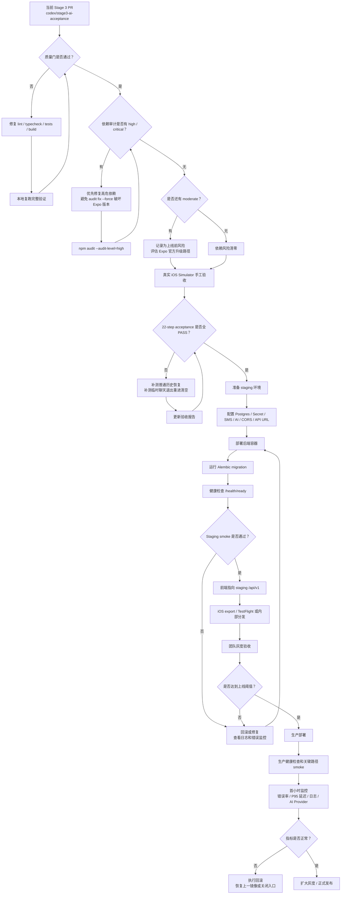

# Stage 3 修复与上线部署流程图

## 当前已处理

- 已移除前端依赖审计中的 high 风险 `brace-expansion`：通过 `overrides` 固定到安全版本。
- 已删除未使用的直接依赖 `@expo/ngrok`，避免旧 `uuid@3.4.0` 进入项目依赖树。
- 当前 PR backend/frontend GitHub checks 已通过，分支可合并。

## 当前仍需上线前处理

- `npm audit` 仍有 Expo 依赖链上的 moderate 风险；不要直接执行 `npm audit fix --force`，需要单独评估 Expo 57 官方升级版本。
- 真实 iOS Simulator 还需人工补跑两项：普通历史重启恢复、临时聊天退出重进清空。
- staging/prod 需要真实环境变量：数据库、短信服务、AI 服务、密钥、CORS、前端 API URL。
