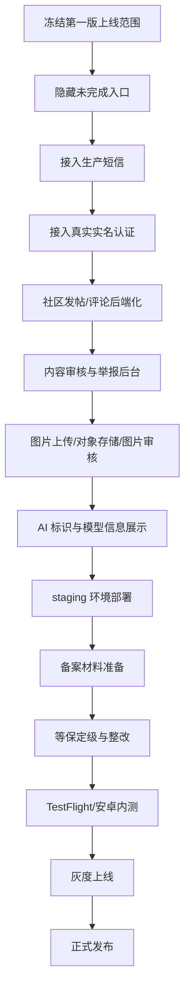

# 杯语 Stage 3 上线修复文档

更新时间：2026-08-01

本文用于整理杯语当前版本距离正式上线的缺口，区分代码内问题、代码外合规/运营问题，并给出推荐修复顺序。本文不是法律意见，备案和资质材料需由公司主体、云服务商、律师或合规顾问共同确认。

## 1. 当前结论

当前项目已经达到可本地演示的 MVP 状态：

- 前端主要页面已搭建，包括首页、AI 聊天、社区、酒谱、酒吧、经典盲盒、我的、设置、登录、实名认证和隐私协议。
- 后端已有账号、内容、酒柜、AI 会话、AI 记忆、额度、临时聊天、内容管理等基础接口。
- AI 聊天已经有真实 Provider 接入边界，也保留开发 Provider 便于本地验收。
- 前端 lint、typecheck、Jest 全量测试已通过。
- 后端 lint、typecheck、pytest 已通过。
- 实名姓名已完成本地脱敏修复，不再写入本机持久化存储。

但是，当前版本还不能直接作为正式上线运营版本。缺口不是纯备案问题，仍然包含多项需要继续编码的功能。

## 2. 问题分类

| 分类 | 是否需要写代码 | 当前判断 |
| --- | --- | --- |
| 社区发帖、评论、举报、审核 | 是 | 生产级能力不足 |
| 真实实名认证 | 是 + 外部服务 | 目前只是本地年龄校验 |
| 生产短信登录 | 是 + 外部服务 | 当前仍有开发短信 Provider |
| AI 合规标识与安全 | 是 + 合规材料 | 需要补 AI 标识、模型信息、内容安全 |
| 图片上传与审核 | 是 + 外部服务 | 当前仍偏本地/静态资源 |
| 内容运营后台 | 是 | 内容管理能力还不完整 |
| 盲盒后端规则 | 是 | 当前偏前端玩法 |
| ICP/App/公安/等保/AI 备案 | 主要代码外 | 需要公司主体和云资源 |
| 域名、服务器、数据库、证书 | 主要代码外 | 需要部署环境 |
| 隐私政策、用户协议、审核制度 | 代码外 + 前端展示 | 需要正式文本和入口 |

## 3. 代码内修复清单

### P0：上线前必须完成

1. 真实实名认证链路

当前状态：
- 前端已做姓名、身份证号输入和年龄校验。
- 只校验身份证格式、生日、是否满 18 岁。
- 不具备真实身份核验能力。

需要修复：
- 接入第三方实名服务商，建议后端调用二要素或三要素接口。
- 前端只提交到后端，不直接调用实名服务商。
- 后端只保存 `realname_verified`、认证时间、供应商流水号或脱敏审计信息。
- 不保存身份证号明文，不在本地展示姓名。
- 增加实名失败、未成年、服务商不可用、频控等错误状态。

验收标准：
- 未满 18 岁不能注册/登录。
- 成年用户实名通过后可继续使用。
- 本地 AsyncStorage、SecureStore、日志、AI 上下文都不出现姓名和身份证号。

2. 生产短信登录

当前状态：
- 本地开发文档仍使用固定验证码。
- 后端支持 development SMS Provider，非 dev 环境会拒绝开发 Provider。

需要修复：
- 接入正式短信服务商。
- 配置短信签名、模板、频控、防刷。
- 登录接口增加 IP、设备、手机号维度限流。
- 验证码错误次数、过期时间、重复发送间隔要可配置。

验收标准：
- 生产环境不能使用固定验证码。
- 短信发送失败有清晰错误提示。
- 不泄露手机号完整信息。

3. 社区发帖与评论后端化

当前状态：
- 前端已有社区、发帖、帖子详情、评论输入。
- 帖子和评论仍有本地/静态合并逻辑。

需要修复：
- 新增后端帖子表、评论表、点赞表、收藏表、举报表。
- 前端发帖调用后端 API。
- 评论发布、删除、分页、关闭评论、举报都走后端。
- 加入作者权限校验。
- 加入内容审核状态：`pending`、`approved`、`rejected`、`hidden`。

验收标准：
- 换设备登录后能看到自己发布的帖子和评论。
- 评论刷新后仍存在。
- 被关闭评论的帖子不能绕过前端直接评论。
- 删除/举报行为进入后端记录。

4. 内容安全与审核后台

当前状态：
- AI 有基础安全策略。
- 社区内容缺少生产级审核闭环。

需要修复：
- 文本敏感词和模型审核。
- 图片审核。
- 举报处理后台。
- 内容下架、恢复、封禁用户。
- 审核日志和操作审计。

验收标准：
- 违规帖子不能直接公开。
- 用户可以举报。
- 管理员可以处理举报并留下审计记录。

5. AI 合规展示与生成内容标识

当前状态：
- AI 聊天功能可用。
- 尚未完整展示 AI 生成内容提示、模型名称、备案号或上线编号。

需要修复：
- AI 聊天页展示“内容由 AI 生成，仅供参考”。
- 设置页或关于页展示模型服务商、模型名称、备案号/上线编号。
- AI 内容分享到社区时标记为 AI 生成。
- 图片、文本等生成内容按监管要求保留显式标识。

验收标准：
- 用户在 AI 入口能明确知道这是 AI 服务。
- 生成内容进入社区时不会伪装成人工内容。

### P1：灰度上线前完成

6. 图片上传与对象存储

当前状态：
- 头像、帖子图片、内容图片仍存在本地 URI 或静态资源路径。

需要修复：
- 接入对象存储和 CDN。
- 图片上传前压缩。
- 上传后生成资源 key。
- 后端持久化资源归属。
- 图片审核通过后再公开展示。

7. 内容运营后台完善

当前状态：
- 后端已有内容管理基础能力。
- 还不是完整运营后台。

需要修复：
- 酒谱、酒吧、酒品知识、首页 banner、每日酒单的后台配置。
- 图片上传。
- 草稿、发布、下架、版本回滚。
- 运营推荐位排序。

8. 经典盲盒后端规则

当前状态：
- 前端体验可用。
- 测试抽卡仍偏本地玩法。

需要修复：
- 后端记录每日抽卡次数。
- 后端生成抽卡结果。
- 卡池、稀有度、活动期可配置。
- 抽卡历史可同步。

9. 搜索后端化

当前状态：
- 搜索偏前端聚合。

需要修复：
- 后端统一搜索接口。
- 搜索酒谱、酒吧、帖子、知识。
- 后续可接全文搜索或专用搜索服务。

10. 设置页和认证页去占位

当前状态：
- 设置、官方认证、设备管理、隐私二级页有 UI，但部分功能是轻实现或占位。

需要修复：
- 第一版不用的入口隐藏。
- 需要保留的入口接后端真实接口。
- 避免用户点击后进入不可用页面。

### P2：正式运营后迭代

11. 推荐系统

需要补充：
- 推荐逻辑来源、推荐理由、用户可关闭个性化推荐。
- 如果形成算法推荐能力，评估算法备案。

12. 数据分析与运营指标

需要补充：
- DAU、留存、发帖率、AI 使用率、转化率。
- 错误率、接口延迟、短信成功率、AI Provider 成功率。

13. 客服和反馈闭环

需要补充：
- 用户反馈入口。
- 举报/投诉处理状态。
- 账号申诉。

## 4. 代码外修复清单

### 公司和基础资源

- 明确上线主体公司。
- 准备营业执照、法人信息、负责人信息。
- 购买域名。
- 购买中国大陆云服务器或确认境外部署策略。
- 准备 SSL 证书。
- 准备对象存储、CDN、短信服务、数据库。

### ICP / App 备案

适用条件：
- App 面向中国大陆用户提供服务。
- API 或官网使用中国大陆服务器。

需要材料：
- 主体信息。
- App 名称、图标、包名、签名证书信息。
- 域名和服务器信息。
- 负责人身份证明和联系方式。
- 服务内容说明。

参考：
- 工信部 App 备案通知：https://www.hunan.gov.cn/zqt/zcsd/202308/t20230809_29456035.html
- 非经营性互联网信息服务备案管理办法：https://www.cac.gov.cn/2005-02/09/c_1112147171.htm

### 公安联网备案

适用条件：
- 网站或 App 开通后需要在规定时间内完成公安联网备案。

需要材料：
- 主体信息。
- 域名、服务器、IP。
- 安全负责人信息。
- App 或网站基本信息。

参考：
- 公安备案说明：https://ga.sz.gov.cn/ZT/HLWSYSQ/

### 等保备案

适用条件：
- 有账号系统、用户内容、AI 聊天、实名状态、日志等数据。

推荐动作：
- 先做等保定级。
- 第一版通常按二级准备。
- 如果社交规模大、影响面大、涉及较多敏感信息，可能需要按三级评估。

需要准备：
- 系统架构图。
- 网络拓扑。
- 资产清单。
- 数据分类分级。
- 安全管理制度。
- 日志审计。
- 备份恢复。

参考：
- 网络安全法等级保护要求：https://www.cac.gov.cn/2016-11/07/c_1119867116_2.htm

### 实名认证合规

需要准备：
- 实名服务商合同。
- 数据处理协议。
- 隐私政策更新。
- 单独同意弹窗。
- 身份证号不落本地、不进 AI、不进普通日志。
- 后端敏感字段加密和脱敏。

推荐实现：
- 前端输入姓名和身份证号。
- HTTPS 提交后端。
- 后端调用实名服务商。
- 后端保存是否通过，不保存身份证号明文。
- 前端只展示“已认证”。

### 社交/UGC 合规

需要准备：
- 用户协议。
- 社区规范。
- 内容审核规则。
- 举报投诉入口。
- 申诉机制。
- 审核员后台。
- 未成年人保护规则。

参考：
- 移动互联网应用程序信息服务管理规定：https://www.cac.gov.cn/2022-06/14/c_1656821626455324.htm
- 互联网跟帖评论服务管理规定：https://www.cac.gov.cn/2022-11/16/c_1670253725725039.htm
- 网络信息内容生态治理规定：https://www.cac.gov.cn/2019-12/20/c_1578375159509309.htm

### AI 服务合规

需要准备：
- 模型服务商名称。
- 模型名称。
- 备案号或上线编号。
- AI 生成内容标识。
- AI 安全评估材料。
- 用户输入和输出内容安全策略。
- AI 使用说明和免责声明。

参考：
- 生成式 AI 服务管理暂行办法：https://www.cac.gov.cn/2023-07/13/c_1690898327029107.htm
- 互联网信息服务算法推荐管理规定：https://www.cac.gov.cn/2022-01/04/c_1642894606364259.htm
- 人工智能生成合成内容标识办法：https://www.cac.gov.cn/2025-03/14/c_1743654684782215.htm

## 5. 推荐修复顺序

## 6. 第一版建议隐藏的功能

如果目标是尽快上线一个可控版本，建议先隐藏或弱化以下入口：

- 官方认证。
- 复杂隐私二级页。
- 设备管理中的不可操作项。
- 未接后端的社区高级互动。
- 未接审核后台的公开发帖能力。
- 盲盒分享社区。
- 任何会让用户以为已完成真实实名或官方资质审核的入口。

## 7. 第一版建议保留的功能

可以保留并打磨：

- 成年确认和登录。
- AI 调酒聊天。
- 临时聊天。
- AI 记忆设置。
- 酒谱浏览。
- 每日酒单。
- 酒品知识。
- 酒吧浏览。
- 个人资料基础编辑。
- 隐私说明、用户协议。

## 8. 上线前验收清单

### 技术验收

- `npm run lint`
- `npm run typecheck`
- `npm test -- --runInBand`
- `npx expo export --platform ios`
- `cd backend && uv run ruff check .`
- `cd backend && uv run ty check`
- `cd backend && uv run pytest`
- `docker compose config` 输出脱敏后归档。
- `docker compose build api`

### 隐私验收

- 普通 AI 消息可持久化到数据库。
- 临时 AI 消息不进入数据库 AI 表。
- 临时 AI 消息不进入容器日志。
- 临时 AI 消息不进入请求日志。
- 临时 AI 消息不进入设备持久化。
- 姓名和身份证号不进入本地持久化。
- 姓名和身份证号不进入 AI 上下文。

### 产品验收

- 登录流程完整。
- 未满 18 岁不能继续。
- AI 聊天可发送、可收到回复、可重试。
- 临时聊天可开启、可退出、不会进历史。
- 社区入口符合当前可用范围。
- 发帖/评论如未完成后端，应隐藏或明确为内测。
- 所有页面无明显溢出、遮挡、按钮不可点。

### 合规验收

- 用户协议完成。
- 隐私政策完成。
- AI 服务说明完成。
- 社区规范完成。
- 举报投诉入口完成。
- App 备案材料准备完成。
- ICP/公安/等保路径确认。
- AI 备案或应用登记路径确认。

## 9. 风险表

| 风险 | 等级 | 原因 | 建议 |
| --- | --- | --- | --- |
| 未实名即开放社交发布 | 高 | 用户生成内容存在监管和风控风险 | 发帖/评论前接实名或至少手机号实名 |
| 评论无审核 | 高 | 违法/不良内容可直接出现 | 上线前补审核、举报、删除 |
| AI 内容未标识 | 高 | 生成式 AI 合规风险 | 增加 AI 标识和模型信息 |
| 身份证号处理不当 | 高 | 敏感个人信息风险 | 只传后端核验，不保存明文 |
| 使用开发短信 | 高 | 任何人可用固定验证码登录 | 生产环境必须禁用 |
| 静态/本地社区数据 | 中 | 换设备或刷新后体验不一致 | 后端化社区模块 |
| 图片无审核 | 中 | 图片违规风险 | 接图片审核服务 |
| 内容版权不清晰 | 中 | 酒吧/酒谱/图片可能侵权 | 建立素材授权清单 |
| Expo 依赖 moderate audit | 中 | 依赖链存在中危提示 | 按 Expo 官方升级路径处理 |

## 10. 推荐里程碑

### M1：可控内测版

- 隐藏未完成入口。
- 生产短信接入。
- 真实 AI Key 和 staging 环境。
- AI 聊天稳定。
- 基础隐私和协议完成。

### M2：社交内测版

- 发帖评论后端化。
- 图片上传。
- 举报入口。
- 管理员审核后台。
- 手机号实名或真实实名 gating。

### M3：合规上线版

- App 备案。
- ICP/公安备案。
- 等保定级。
- AI 备案/登记和内容标识。
- 社区规范、审核制度、投诉处理流程。
- TestFlight/安卓内测验收。

### M4：正式运营版

- 监控告警。
- 备份恢复。
- 运营后台。
- 内容版权台账。
- 客服和申诉机制。
- 灰度发布和回滚预案。
