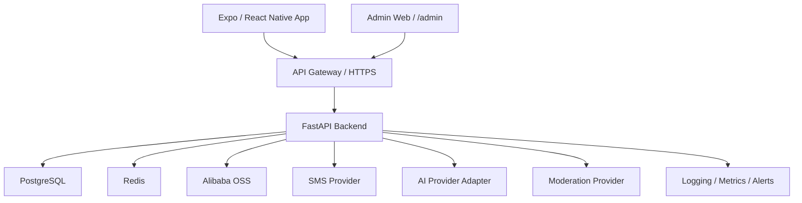
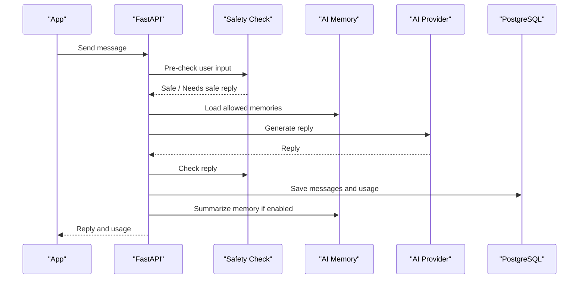
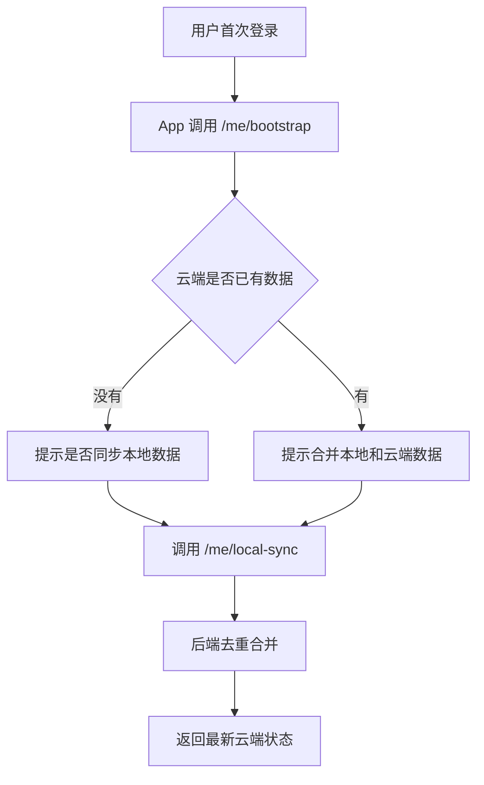
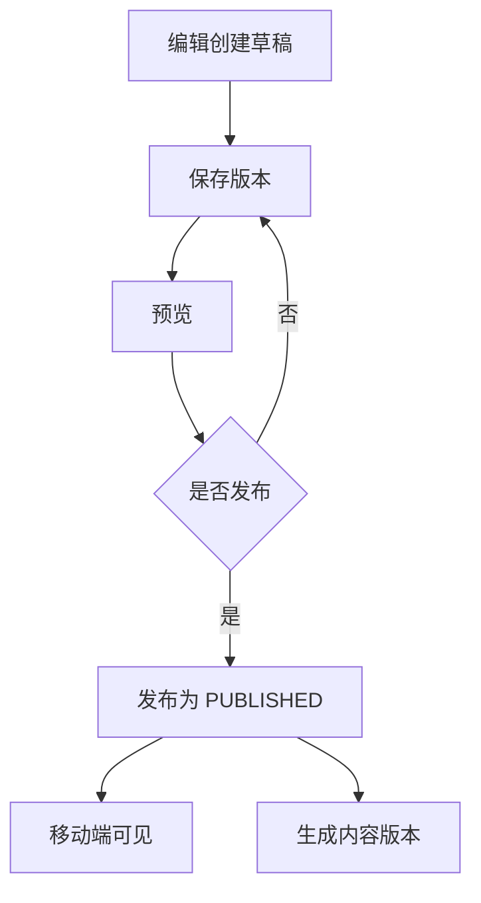
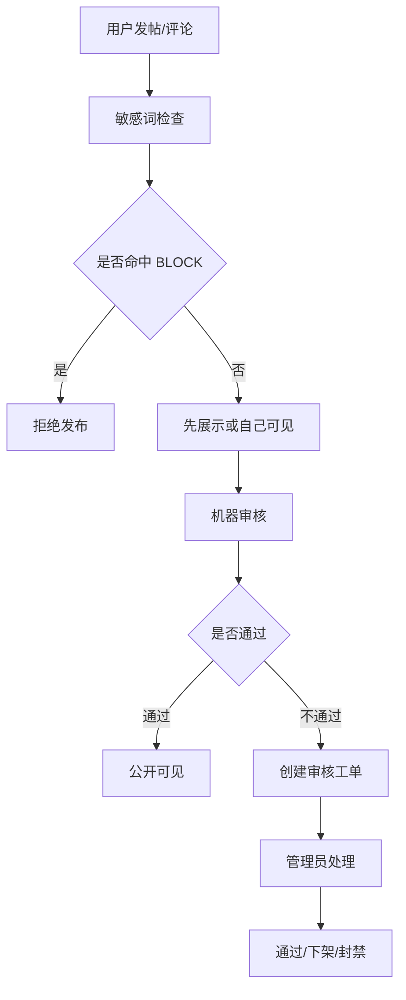

# 后端架构设计文档：调酒社交 App v1

## 1. 文档目的

本文件用于指导第一版真实后端开发。当前前端已经接近完成，后端需要补齐账号、资料、酒柜、AI 会话、AI 记忆、社区、盲盒历史、后台内容维护等能力，让应用从本地模拟数据进入可上线状态。

本文档优先解决四件事：

- 数据库表怎么拆，哪些数据必须真实落库。
- 后端模块各自负责什么，模块边界在哪里。
- 前端和后台需要哪些接口，接口规则是什么。
- 上线阶段怎么拆，先做什么，后做什么。

## 2. 产品结论

### 2.1 第一版目标

第一版目标是“先能上线”，不追求复杂推荐、复杂通知和完整商业闭环。后端要稳定支撑以下真实数据：

- 账号和登录状态。
- 用户资料和隐私设置。
- 私人酒柜。
- AI 会话。
- AI 记忆。
- 社区发帖、评论、点赞、收藏、关注、举报。
- 盲盒抽取历史。

以下数据第一版可以由后台人工维护：

- 酒谱。
- 酒吧。
- 酒品知识。
- 首页 banner 和快捷入口。
- 敏感词。

以下能力后放：

- App 推送通知。
- 复杂个性化推荐流。
- 线上支付。
- AI 流式输出。
- 多端复杂冲突编辑。
- 用户数据导出。

### 2.2 用户和业务定位

App 的核心体验不是“非常聪明的工具型 AI”，而是“真实可聊天、有情绪价值的调酒陪伴”。AI 的角色应该更像温柔调酒师，能陪用户聊天、理解饮酒偏好、记住轻量偏好，但不能鼓励过量饮酒。

### 2.3 第一版关键规则

- 登录方式：手机号验证码登录。
- 地区：优先中国大陆。
- 登录有效期：90 天。
- 单账号设备数：最多 5 台。
- 年龄确认：前端确认，后端记录确认时间。
- 后端技术：Python + FastAPI。
- 数据库：PostgreSQL。
- 云服务：阿里云。
- 文件存储：阿里云 OSS。
- AI 输出：第一版普通请求/响应，不做流式。
- AI 免费额度：每个用户每天 50 条。
- 会员：第一版只预留会员字段和额度扩展，不接支付。
- AI 记忆：只记饮酒偏好、情绪偏好、禁忌和安全提醒，用户可查看、删除、关闭。
- 临时聊天：不保存聊天内容和记忆，但仍计入每日用量。
- 社区内容：先发后审，违规可下架。
- 图片：上传后先自己可见，机器审核通过后公开可见。
- 被封禁用户：可以登录、看自己的数据，但不能发帖、评论、使用 AI。
- 删除账号：账号身份删除，公开内容保留但作者匿名化。

## 3. 总体架构

### 3.1 架构形态

第一版采用 FastAPI 模块化单体架构。理由是：

- 团队早期开发速度更快。
- 业务模块虽多，但还没有高并发拆微服务的必要。
- 后续如果 AI、社区、内容后台压力变大，可以从模块化单体中拆服务。



### 3.2 推荐技术栈

| 层级 | 技术 | 说明 |
| --- | --- | --- |
| API 框架 | FastAPI | REST API、后台接口、OpenAPI 文档 |
| ORM | SQLModel 或 SQLAlchemy 2.x | PostgreSQL 数据建模 |
| 数据库 | PostgreSQL | 主业务数据 |
| 缓存和限流 | Redis | 验证码、频控、短期状态 |
| 对象存储 | 阿里云 OSS | 头像、帖子图片、内容图片 |
| 短信 | 阿里云短信或等价服务 | 手机号验证码 |
| AI | Provider Adapter | 第一版接阿里云兼容模型，保留替换能力 |
| 图片审核 | 阿里云内容安全或等价服务 | 图片公开前审核 |
| 迁移 | Alembic | 数据库版本迁移 |
| 测试 | pytest + HTTPX | 单元测试、接口测试 |
| 质量 | Ruff + ty 或 mypy | Lint 和类型检查 |
| 部署 | 阿里云 ECS/容器服务 + RDS + Redis | 先简单稳定上线 |

### 3.3 API 基础规则

所有移动端接口统一放在：

```text
/api/v1
```

后台管理页面和后台接口统一放在：

```text
/admin
/api/v1/admin
```

接口返回字段使用 camelCase。数据库字段可以使用 snake_case。

错误响应统一为：

```json
{
  "error": {
    "code": "VALIDATION_ERROR",
    "message": "输入内容不符合要求",
    "details": {}
  }
}
```

列表分页统一为：

```json
{
  "data": [],
  "pagination": {
    "page": 1,
    "pageSize": 20,
    "totalItems": 0,
    "totalPages": 0
  }
}
```

常用 HTTP 状态：

| 状态码 | 含义 |
| --- | --- |
| 200 | 成功 |
| 201 | 创建成功 |
| 204 | 删除成功，无返回体 |
| 400 | 请求格式错误 |
| 401 | 未登录 |
| 403 | 无权限 |
| 404 | 资源不存在 |
| 409 | 状态冲突，例如重复点赞或版本冲突 |
| 422 | 参数校验失败 |
| 429 | 请求太频繁 |
| 500 | 服务端错误，不暴露内部细节 |

### 3.4 工程结构建议

```text
backend/
  app/
    main.py
    core/
      config.py
      security.py
      rate_limit.py
      errors.py
    db/
      session.py
      models/
      migrations/
    api/
      v1/
        auth.py
        me.py
        profile.py
        cellar.py
        media.py
        ai.py
        community.py
        content.py
        blind_box.py
        admin/
    modules/
      auth/
      users/
      cellar/
      media/
      ai/
      community/
      content/
      moderation/
      blind_box/
      admin/
    integrations/
      oss/
      sms/
      ai_provider/
      moderation_provider/
    schemas/
    workers/
  tests/
    api/
    modules/
  pyproject.toml
```

建议开发命令：

```bash
uv sync
uv run fastapi dev app/main.py
uv run pytest
uv run ruff check .
uv run alembic upgrade head
```

## 4. 模块职责

### 4.1 Auth 认证模块

负责手机号验证码登录、刷新登录态、退出、设备管理。

职责：

- 发送短信验证码。
- 校验验证码。
- 创建 access token 和 refresh token。
- 刷新 access token。
- 管理最多 5 台登录设备。
- 固定测试验证码仅允许在 dev 和 staging 环境使用。
- 对验证码、登录、刷新做频控。

不负责：

- 用户资料展示。
- 社区权限判断细节。
- AI 额度判断细节。

### 4.2 User/Profile 用户模块

负责用户基础资料、隐私设置、年龄确认、账号删除。

职责：

- 保存昵称、头像、签名、城市、生日、性别等资料。
- 默认资料私密，用户主动设置可见范围。
- 记录年龄确认时间。
- 处理账号删除和匿名化。
- 提供 `/me/bootstrap` 启动同步接口。
- 处理首次登录后的本地数据同步选择。

### 4.3 Cellar 酒柜模块

负责私人酒柜数据。

职责：

- 保存用户拥有的酒品和配料。
- 支持本地数据合并到云端。
- 支持添加、删除、批量更新。
- 默认完全私密。

不负责：

- 把完整酒柜公开给社区。
- 复杂库存、价格、购买记录。

### 4.4 Media 媒体模块

负责头像、帖子图片、内容图片的上传和审核状态。

职责：

- 给前端签发 OSS 临时上传凭证。
- 记录媒体文件元数据。
- 校验文件类型和大小。
- 接收上传完成回调或前端确认。
- 调用图片审核服务。
- 控制媒体公开状态。

关键规则：

- 新上传图片先是 `SELF_VISIBLE`。
- 审核通过后变为 `PUBLIC`。
- 审核拒绝后变为 `REJECTED`，不可公开展示。

### 4.5 AI Chat AI 会话模块

负责 AI 聊天、临时聊天、会话历史、每日额度、AI 安全策略。

职责：

- 创建会话。
- 保存普通会话消息。
- 临时聊天不保存内容。
- 调用 AI Provider Adapter。
- 统计每日使用量。
- 生成会话标题。
- 删除用户可见会话。
- 对过量饮酒、自伤等风险内容做安全处理。
- 对被封禁用户禁用 AI。

不负责：

- 复杂推荐系统。
- 流式输出。
- 付费扣款。

### 4.6 AI Memory AI 记忆模块

负责 AI 可控记忆。

职责：

- 从非临时聊天中自动总结轻量记忆。
- 只保存饮酒偏好、情绪偏好、禁忌和安全提醒。
- 用户可查看、删除、关闭记忆。
- 用户删除记忆后，不从旧聊天重新学习该记忆。
- 给 AI 会话提供可解释的记忆上下文。

不保存：

- 用户具体生活事件。
- 过度隐私信息。
- 身份证、住址、银行卡等敏感信息。

### 4.7 Community 社区模块

负责帖子、评论、点赞、收藏、关注、举报。

职责：

- 发帖、编辑、软删除。
- 评论、删除评论。
- 点赞、取消点赞。
- 收藏、取消收藏。
- 关注、取消关注。
- 举报帖子或评论。
- 敏感词过滤评论和帖子内容。
- 支持帖子关联酒谱。
- 支持盲盒结果生成帖子草稿。

规则：

- 社区帖子可以关联酒谱，但不能暴露完整私人酒柜。
- 评论被删除后显示“评论已删除”。
- 被封禁用户不能发帖、评论、点赞、关注。

### 4.8 Moderation 审核模块

负责内容审核和工单。

职责：

- 接收机器审核结果。
- 根据举报创建审核工单。
- 支持管理员手动创建工单。
- 记录审核处理动作。
- 下架违规内容并通知用户。
- 对多次违规用户执行封禁。
- 维护敏感词表。

### 4.9 Content 内容模块

负责后台维护的酒谱、酒吧、酒品知识、首页配置。

职责：

- 草稿、预览、发布。
- 历史版本保存。
- 回滚历史版本。
- 基础搜索。
- 酒吧保存经纬度。
- 首页 banner 和快捷入口配置。

### 4.10 Blind Box 盲盒模块

负责每日抽卡和历史记录。

职责：

- 每日免费抽一次。
- 记录抽取历史。
- 会员更多次数后续扩展。
- 支持抽到结果后创建社区帖子草稿。

### 4.11 Notification 通知模块

第一版只建表，不做推送。

职责：

- 记录系统通知、审核通知、互动通知。
- App 后续可通过接口拉取。

### 4.12 Admin 后台模块

负责后台用户、权限、审计日志、内容管理、审核管理。

角色：

- `SUPER_ADMIN`：全部权限。
- `EDITOR`：内容维护。
- `MODERATOR`：社区审核。

规则：

- 所有后台操作必须写审计日志。
- 后台接口必须二次鉴权和角色授权。

## 5. 数据库表设计

### 5.1 通用约定

- 主键统一使用 `uuid`。
- 所有核心表包含 `created_at`、`updated_at`。
- 用户可删除内容优先软删除，使用 `deleted_at`。
- 对外 API 不暴露自增序列。
- 手机号不明文存储，使用 `phone_hash` 查询，必要时加密保存脱敏展示字段。
- refresh token 只保存哈希，不保存明文。
- 用户输入内容保留审核状态和删除状态。

### 5.2 账号与用户

#### users

用户主表。

| 字段 | 类型 | 说明 |
| --- | --- | --- |
| id | uuid | 用户 ID |
| phone_hash | text | 手机号哈希 |
| phone_masked | text | 脱敏手机号，例如 138****1234 |
| status | enum | `ACTIVE`、`BANNED`、`DELETED` |
| age_confirmed_at | timestamptz | 年龄确认时间 |
| memory_enabled | boolean | 是否启用 AI 记忆 |
| membership_level | enum | `FREE`、`MEMBER`，第一版预留 |
| deleted_at | timestamptz | 删除时间 |
| anonymized_at | timestamptz | 匿名化时间 |
| created_at | timestamptz | 创建时间 |
| updated_at | timestamptz | 更新时间 |

索引：

- `unique(phone_hash)`，但删除账号后需要支持重新注册策略。
- `index(status)`。

#### user_profiles

用户资料表。

| 字段 | 类型 | 说明 |
| --- | --- | --- |
| user_id | uuid | 用户 ID |
| nickname | varchar(40) | 昵称 |
| avatar_media_id | uuid | 头像媒体 ID |
| signature | varchar(160) | 个性签名 |
| city | varchar(80) | 城市 |
| gender | enum/null | 性别，可空 |
| birthday | date/null | 生日，可空 |
| visibility | jsonb | 字段可见范围，默认私密 |
| created_at | timestamptz | 创建时间 |
| updated_at | timestamptz | 更新时间 |

#### user_devices

登录设备表。

| 字段 | 类型 | 说明 |
| --- | --- | --- |
| id | uuid | 设备 ID |
| user_id | uuid | 用户 ID |
| platform | enum | `IOS`、`ANDROID`、`WEB` |
| device_name | varchar(120) | 设备名称 |
| app_version | varchar(40) | App 版本 |
| last_active_at | timestamptz | 最近活跃 |
| revoked_at | timestamptz | 手动踢出时间 |
| created_at | timestamptz | 创建时间 |

约束：

- 同一用户最多 5 个未撤销设备。

#### auth_sessions

刷新令牌表。

| 字段 | 类型 | 说明 |
| --- | --- | --- |
| id | uuid | 会话 ID |
| user_id | uuid | 用户 ID |
| device_id | uuid | 设备 ID |
| refresh_token_hash | text | refresh token 哈希 |
| expires_at | timestamptz | 90 天有效期 |
| revoked_at | timestamptz | 失效时间 |
| created_at | timestamptz | 创建时间 |

#### sms_codes

短信验证码表。

| 字段 | 类型 | 说明 |
| --- | --- | --- |
| id | uuid | 验证码记录 ID |
| phone_hash | text | 手机号哈希 |
| scene | enum | `LOGIN`、`BIND_PHONE` |
| code_hash | text | 验证码哈希 |
| expires_at | timestamptz | 过期时间 |
| consumed_at | timestamptz | 使用时间 |
| ip_address | inet | 请求 IP |
| created_at | timestamptz | 创建时间 |

### 5.3 酒柜

#### cellar_items

用户私人酒柜表。

| 字段 | 类型 | 说明 |
| --- | --- | --- |
| id | uuid | 酒柜条目 ID |
| user_id | uuid | 用户 ID |
| ingredient_id | uuid/null | 系统配料 ID |
| custom_name | varchar(80)/null | 自定义名称 |
| amount_label | varchar(40)/null | 数量描述 |
| note | varchar(200)/null | 备注 |
| source | enum | `MANUAL`、`LOCAL_SYNC` |
| deleted_at | timestamptz | 删除时间 |
| created_at | timestamptz | 创建时间 |
| updated_at | timestamptz | 更新时间 |

约束：

- 同一用户同一 `ingredient_id` 未删除时不重复。

### 5.4 媒体

#### media_assets

媒体资源表。

| 字段 | 类型 | 说明 |
| --- | --- | --- |
| id | uuid | 媒体 ID |
| owner_user_id | uuid/null | 上传用户，后台内容可为空 |
| kind | enum | `AVATAR`、`POST_IMAGE`、`CONTENT_IMAGE` |
| oss_bucket | varchar(80) | OSS bucket |
| oss_key | text | OSS key |
| url | text | CDN 或签名访问地址 |
| mime_type | varchar(80) | 文件类型 |
| size_bytes | int | 文件大小 |
| width | int/null | 图片宽 |
| height | int/null | 图片高 |
| review_status | enum | `PENDING`、`PASSED`、`REJECTED` |
| visibility | enum | `SELF_VISIBLE`、`PUBLIC`、`REJECTED` |
| created_at | timestamptz | 创建时间 |
| updated_at | timestamptz | 更新时间 |

### 5.5 内容库

#### ingredients

酒品和配料基础表。

| 字段 | 类型 | 说明 |
| --- | --- | --- |
| id | uuid | 配料 ID |
| name | varchar(80) | 名称 |
| category | varchar(40) | 类别 |
| image_media_id | uuid/null | 图片 |
| description | text/null | 描述 |
| status | enum | `DRAFT`、`PUBLISHED`、`ARCHIVED` |
| created_at | timestamptz | 创建时间 |
| updated_at | timestamptz | 更新时间 |

#### recipes

酒谱表。

| 字段 | 类型 | 说明 |
| --- | --- | --- |
| id | uuid | 酒谱 ID |
| slug | varchar(120) | URL 友好标识 |
| title | varchar(120) | 标题 |
| subtitle | varchar(160)/null | 副标题 |
| description | text | 描述 |
| image_media_id | uuid/null | 主图 |
| difficulty | enum | 难度 |
| prep_minutes | int/null | 制作时间 |
| ingredients | jsonb | 配方结构 |
| steps | jsonb | 步骤 |
| tags | text[] | 标签 |
| status | enum | `DRAFT`、`PUBLISHED`、`ARCHIVED` |
| published_at | timestamptz/null | 发布时间 |
| created_by_admin_id | uuid | 创建管理员 |
| updated_by_admin_id | uuid | 更新管理员 |
| created_at | timestamptz | 创建时间 |
| updated_at | timestamptz | 更新时间 |

#### bars

酒吧表。

| 字段 | 类型 | 说明 |
| --- | --- | --- |
| id | uuid | 酒吧 ID |
| name | varchar(120) | 名称 |
| city | varchar(80) | 城市 |
| address | varchar(240) | 地址 |
| latitude | numeric(10, 7) | 纬度 |
| longitude | numeric(10, 7) | 经度 |
| description | text/null | 描述 |
| cover_media_id | uuid/null | 封面 |
| tags | text[] | 标签 |
| status | enum | `DRAFT`、`PUBLISHED`、`ARCHIVED` |
| published_at | timestamptz/null | 发布时间 |
| created_at | timestamptz | 创建时间 |
| updated_at | timestamptz | 更新时间 |

#### drink_knowledge_entries

酒品知识表。

| 字段 | 类型 | 说明 |
| --- | --- | --- |
| id | uuid | 知识 ID |
| title | varchar(120) | 标题 |
| summary | varchar(240) | 摘要 |
| body | text | 正文 |
| cover_media_id | uuid/null | 封面 |
| tags | text[] | 标签 |
| status | enum | `DRAFT`、`PUBLISHED`、`ARCHIVED` |
| published_at | timestamptz/null | 发布时间 |
| created_at | timestamptz | 创建时间 |
| updated_at | timestamptz | 更新时间 |

#### home_banners / home_shortcuts

首页配置表。

| 表 | 说明 |
| --- | --- |
| home_banners | 首页 banner、跳转目标、排序、上下线时间 |
| home_shortcuts | 首页快捷入口、图标、跳转路径、排序 |

#### content_versions

内容版本表，用于预览、回滚和审计。

| 字段 | 类型 | 说明 |
| --- | --- | --- |
| id | uuid | 版本 ID |
| content_type | enum | `RECIPE`、`BAR`、`KNOWLEDGE`、`BANNER`、`SHORTCUT` |
| content_id | uuid | 内容 ID |
| version_no | int | 版本号 |
| snapshot | jsonb | 内容快照 |
| created_by_admin_id | uuid | 操作人 |
| created_at | timestamptz | 创建时间 |

### 5.6 社区

#### posts

帖子表。

| 字段 | 类型 | 说明 |
| --- | --- | --- |
| id | uuid | 帖子 ID |
| author_id | uuid | 作者 |
| recipe_id | uuid/null | 可关联酒谱 |
| title | varchar(120) | 标题 |
| body | text | 正文 |
| status | enum | `VISIBLE`、`SELF_VISIBLE`、`TAKEN_DOWN` |
| moderation_status | enum | `PENDING`、`PASSED`、`REJECTED` |
| like_count | int | 点赞数 |
| comment_count | int | 评论数 |
| favorite_count | int | 收藏数 |
| deleted_at | timestamptz | 用户删除时间 |
| created_at | timestamptz | 创建时间 |
| updated_at | timestamptz | 更新时间 |

#### post_media

帖子图片关联表。

| 字段 | 类型 | 说明 |
| --- | --- | --- |
| id | uuid | 关联 ID |
| post_id | uuid | 帖子 ID |
| media_id | uuid | 媒体 ID |
| sort_order | int | 排序 |

#### comments

评论表。

| 字段 | 类型 | 说明 |
| --- | --- | --- |
| id | uuid | 评论 ID |
| post_id | uuid | 帖子 ID |
| author_id | uuid | 作者 |
| parent_comment_id | uuid/null | 回复哪条评论 |
| body | text | 内容 |
| status | enum | `VISIBLE`、`DELETED`、`TAKEN_DOWN` |
| moderation_status | enum | `PASSED`、`REJECTED` |
| deleted_at | timestamptz | 删除时间 |
| created_at | timestamptz | 创建时间 |
| updated_at | timestamptz | 更新时间 |

#### post_likes

帖子点赞表。

| 字段 | 类型 | 说明 |
| --- | --- | --- |
| id | uuid | 点赞 ID |
| post_id | uuid | 帖子 ID |
| user_id | uuid | 用户 ID |
| created_at | timestamptz | 创建时间 |

约束：

- `unique(post_id, user_id)`。

#### post_favorites

帖子收藏表。

| 字段 | 类型 | 说明 |
| --- | --- | --- |
| id | uuid | 收藏 ID |
| post_id | uuid | 帖子 ID |
| user_id | uuid | 用户 ID |
| created_at | timestamptz | 创建时间 |

约束：

- `unique(post_id, user_id)`。

#### follows

关注关系表。

| 字段 | 类型 | 说明 |
| --- | --- | --- |
| id | uuid | 关注 ID |
| follower_id | uuid | 发起关注的人 |
| following_id | uuid | 被关注的人 |
| created_at | timestamptz | 创建时间 |

约束：

- `unique(follower_id, following_id)`。
- `follower_id != following_id`。

### 5.7 审核

#### reports

用户举报表。

| 字段 | 类型 | 说明 |
| --- | --- | --- |
| id | uuid | 举报 ID |
| reporter_id | uuid | 举报人 |
| target_type | enum | `POST`、`COMMENT`、`USER` |
| target_id | uuid | 被举报目标 |
| reason | varchar(80) | 原因 |
| description | text/null | 补充说明 |
| created_at | timestamptz | 创建时间 |

#### moderation_tickets

审核工单表。

| 字段 | 类型 | 说明 |
| --- | --- | --- |
| id | uuid | 工单 ID |
| source | enum | `REPORT`、`MACHINE_REVIEW`、`ADMIN_MANUAL` |
| target_type | enum | `POST`、`COMMENT`、`MEDIA`、`USER` |
| target_id | uuid | 目标 ID |
| status | enum | `OPEN`、`RESOLVED`、`REJECTED` |
| priority | enum | `LOW`、`NORMAL`、`HIGH` |
| assigned_admin_id | uuid/null | 处理人 |
| created_at | timestamptz | 创建时间 |
| updated_at | timestamptz | 更新时间 |

#### moderation_actions

审核动作表。

| 字段 | 类型 | 说明 |
| --- | --- | --- |
| id | uuid | 动作 ID |
| ticket_id | uuid | 工单 ID |
| admin_id | uuid | 操作人 |
| action | enum | `PASS`、`TAKE_DOWN`、`BAN_USER`、`UNBAN_USER`、`IGNORE` |
| note | text/null | 备注 |
| created_at | timestamptz | 创建时间 |

#### sensitive_words

敏感词表。

| 字段 | 类型 | 说明 |
| --- | --- | --- |
| id | uuid | 敏感词 ID |
| word | varchar(80) | 词 |
| severity | enum | `BLOCK`、`REVIEW` |
| enabled | boolean | 是否启用 |
| created_by_admin_id | uuid | 创建人 |
| created_at | timestamptz | 创建时间 |
| updated_at | timestamptz | 更新时间 |

### 5.8 AI 会话和记忆

#### ai_conversations

AI 会话表。

| 字段 | 类型 | 说明 |
| --- | --- | --- |
| id | uuid | 会话 ID |
| user_id | uuid | 用户 ID |
| title | varchar(80) | 后端生成标题 |
| status | enum | `ACTIVE`、`USER_DELETED` |
| last_message_at | timestamptz | 最近消息时间 |
| created_at | timestamptz | 创建时间 |
| updated_at | timestamptz | 更新时间 |

#### ai_messages

AI 消息表。只保存普通会话，临时聊天不写入。

| 字段 | 类型 | 说明 |
| --- | --- | --- |
| id | uuid | 消息 ID |
| conversation_id | uuid | 会话 ID |
| user_id | uuid | 用户 ID |
| role | enum | `USER`、`ASSISTANT`、`SYSTEM` |
| content | text | 消息内容 |
| safety_label | enum/null | 安全标签 |
| created_at | timestamptz | 创建时间 |

#### ai_memories

AI 记忆表。

| 字段 | 类型 | 说明 |
| --- | --- | --- |
| id | uuid | 记忆 ID |
| user_id | uuid | 用户 ID |
| category | enum | `DRINK_PREFERENCE`、`EMOTIONAL_PREFERENCE`、`SAFETY_REMINDER` |
| summary | varchar(240) | 记忆摘要 |
| source_message_id | uuid/null | 来源消息 |
| status | enum | `ACTIVE`、`DELETED` |
| deleted_at | timestamptz/null | 删除时间 |
| created_at | timestamptz | 创建时间 |
| updated_at | timestamptz | 更新时间 |

规则：

- 用户删除后状态改为 `DELETED`。
- 后续记忆总结不能从旧聊天重新生成已删除记忆。

#### ai_usage_logs

AI 使用日志表。

| 字段 | 类型 | 说明 |
| --- | --- | --- |
| id | uuid | 日志 ID |
| user_id | uuid | 用户 ID |
| conversation_id | uuid/null | 临时聊天为空 |
| mode | enum | `NORMAL`、`TEMPORARY` |
| input_tokens | int/null | 输入 token，供应商返回后记录 |
| output_tokens | int/null | 输出 token |
| provider | varchar(80) | AI 供应商 |
| cost_estimate | numeric/null | 成本估算 |
| safety_label | enum/null | 安全标签 |
| created_at | timestamptz | 创建时间 |

说明：

- 不保存 raw request/response。
- 可以保存最终回复和用量统计。

#### ai_daily_quotas

AI 每日额度表。

| 字段 | 类型 | 说明 |
| --- | --- | --- |
| id | uuid | 额度记录 ID |
| user_id | uuid | 用户 ID |
| quota_date | date | 日期 |
| free_limit | int | 免费额度，默认 50 |
| used_count | int | 已用次数 |
| created_at | timestamptz | 创建时间 |
| updated_at | timestamptz | 更新时间 |

约束：

- `unique(user_id, quota_date)`。

### 5.9 盲盒

#### blind_box_draws

盲盒抽取历史。

| 字段 | 类型 | 说明 |
| --- | --- | --- |
| id | uuid | 抽取 ID |
| user_id | uuid | 用户 ID |
| draw_date | date | 抽取日期 |
| card_key | varchar(120) | 抽中的卡片 key |
| card_snapshot | jsonb | 当时卡片内容快照 |
| created_post_draft_id | uuid/null | 生成的帖子草稿 ID |
| created_at | timestamptz | 创建时间 |

约束：

- 免费用户 `unique(user_id, draw_date)`。

### 5.10 通知

#### notifications

通知表，第一版只存储，不做系统推送。

| 字段 | 类型 | 说明 |
| --- | --- | --- |
| id | uuid | 通知 ID |
| user_id | uuid | 接收人 |
| type | enum | `SYSTEM`、`MODERATION`、`LIKE`、`COMMENT`、`FOLLOW` |
| title | varchar(120) | 标题 |
| body | varchar(500) | 内容 |
| payload | jsonb | 跳转参数 |
| read_at | timestamptz/null | 已读时间 |
| created_at | timestamptz | 创建时间 |

### 5.11 后台管理

#### admin_users

后台用户表。

| 字段 | 类型 | 说明 |
| --- | --- | --- |
| id | uuid | 管理员 ID |
| username | varchar(80) | 用户名 |
| password_hash | text | 密码哈希 |
| role | enum | `SUPER_ADMIN`、`EDITOR`、`MODERATOR` |
| status | enum | `ACTIVE`、`DISABLED` |
| last_login_at | timestamptz/null | 最近登录 |
| created_at | timestamptz | 创建时间 |
| updated_at | timestamptz | 更新时间 |

#### admin_audit_logs

后台审计日志表。

| 字段 | 类型 | 说明 |
| --- | --- | --- |
| id | uuid | 日志 ID |
| admin_id | uuid | 操作人 |
| action | varchar(120) | 操作 |
| target_type | varchar(80) | 目标类型 |
| target_id | uuid/null | 目标 ID |
| before_snapshot | jsonb/null | 操作前 |
| after_snapshot | jsonb/null | 操作后 |
| ip_address | inet | IP |
| created_at | timestamptz | 创建时间 |

## 6. 接口清单

### 6.1 Auth 认证接口

| 方法 | 路径 | 登录 | 说明 |
| --- | --- | --- | --- |
| POST | `/api/v1/auth/sms-codes` | 否 | 发送登录验证码 |
| POST | `/api/v1/auth/login` | 否 | 手机号验证码登录 |
| POST | `/api/v1/auth/refresh` | 否 | refresh token 换 access token |
| POST | `/api/v1/auth/logout` | 是 | 当前设备退出 |
| GET | `/api/v1/auth/devices` | 是 | 获取登录设备 |
| DELETE | `/api/v1/auth/devices/{deviceId}` | 是 | 移除某台设备 |

### 6.2 Me/Profile 用户接口

| 方法 | 路径 | 登录 | 说明 |
| --- | --- | --- | --- |
| GET | `/api/v1/me/bootstrap` | 是 | App 启动同步，返回用户、资料、权限、计数、关键配置 |
| GET | `/api/v1/me/profile` | 是 | 获取我的资料 |
| PATCH | `/api/v1/me/profile` | 是 | 修改资料 |
| PATCH | `/api/v1/me/privacy` | 是 | 修改隐私设置 |
| POST | `/api/v1/me/age-confirmation` | 是 | 记录年龄确认 |
| POST | `/api/v1/me/local-sync` | 是 | 首次登录后同步本地数据 |
| DELETE | `/api/v1/me/account` | 是 | 删除账号，执行匿名化策略 |

`/me/bootstrap` 建议返回：

```json
{
  "user": {},
  "profile": {},
  "privacy": {},
  "accountSecurity": {},
  "ai": {
    "memoryEnabled": true,
    "dailyLimit": 50,
    "usedToday": 0
  },
  "featureFlags": {},
  "serverTime": "2026-07-28T00:00:00Z"
}
```

### 6.3 Cellar 酒柜接口

| 方法 | 路径 | 登录 | 说明 |
| --- | --- | --- | --- |
| GET | `/api/v1/cellar/items` | 是 | 获取我的酒柜 |
| POST | `/api/v1/cellar/items` | 是 | 添加酒柜条目 |
| PATCH | `/api/v1/cellar/items/{itemId}` | 是 | 修改酒柜条目 |
| DELETE | `/api/v1/cellar/items/{itemId}` | 是 | 删除酒柜条目 |
| POST | `/api/v1/cellar/items/batch` | 是 | 批量同步本地酒柜 |

### 6.4 Media 媒体接口

| 方法 | 路径 | 登录 | 说明 |
| --- | --- | --- | --- |
| POST | `/api/v1/media/upload-credentials` | 是 | 获取 OSS 临时上传凭证 |
| POST | `/api/v1/media/{mediaId}/complete` | 是 | 前端上传完成后确认 |
| GET | `/api/v1/media/{mediaId}` | 是 | 获取媒体状态 |

### 6.5 AI 接口

| 方法 | 路径 | 登录 | 说明 |
| --- | --- | --- | --- |
| GET | `/api/v1/ai/conversations` | 是 | 获取会话列表 |
| POST | `/api/v1/ai/conversations` | 是 | 创建会话 |
| GET | `/api/v1/ai/conversations/{conversationId}` | 是 | 获取会话详情 |
| GET | `/api/v1/ai/conversations/{conversationId}/messages` | 是 | 获取消息列表 |
| POST | `/api/v1/ai/conversations/{conversationId}/messages` | 是 | 发送普通聊天消息 |
| DELETE | `/api/v1/ai/conversations/{conversationId}` | 是 | 删除用户可见会话 |
| POST | `/api/v1/ai/temporary-messages` | 是 | 临时聊天，不保存内容 |
| GET | `/api/v1/ai/memories` | 是 | 获取 AI 记忆列表 |
| DELETE | `/api/v1/ai/memories/{memoryId}` | 是 | 删除某条记忆 |
| PATCH | `/api/v1/ai/memory-settings` | 是 | 开关 AI 记忆 |
| GET | `/api/v1/ai/usage/today` | 是 | 获取今日额度和已用次数 |

普通聊天请求：

```json
{
  "content": "今天有点烦，想喝点清爽的",
  "clientMessageId": "local-uuid"
}
```

普通聊天响应：

```json
{
  "userMessage": {},
  "assistantMessage": {},
  "conversation": {},
  "usage": {
    "dailyLimit": 50,
    "usedToday": 12
  }
}
```

临时聊天规则：

- 不创建 `ai_conversations`。
- 不写入 `ai_messages`。
- 不写入 `ai_memories`。
- 写入 `ai_usage_logs`，用于额度、成本和风控统计。

### 6.6 Community 社区接口

| 方法 | 路径 | 登录 | 说明 |
| --- | --- | --- | --- |
| GET | `/api/v1/posts` | 可选 | 帖子列表 |
| POST | `/api/v1/posts` | 是 | 发布帖子 |
| GET | `/api/v1/posts/{postId}` | 可选 | 帖子详情 |
| PATCH | `/api/v1/posts/{postId}` | 是 | 修改自己的帖子 |
| DELETE | `/api/v1/posts/{postId}` | 是 | 删除自己的帖子 |
| POST | `/api/v1/posts/{postId}/likes` | 是 | 点赞 |
| DELETE | `/api/v1/posts/{postId}/likes` | 是 | 取消点赞 |
| POST | `/api/v1/posts/{postId}/favorites` | 是 | 收藏 |
| DELETE | `/api/v1/posts/{postId}/favorites` | 是 | 取消收藏 |
| GET | `/api/v1/posts/{postId}/comments` | 可选 | 评论列表 |
| POST | `/api/v1/posts/{postId}/comments` | 是 | 发表评论 |
| DELETE | `/api/v1/comments/{commentId}` | 是 | 删除自己的评论 |
| POST | `/api/v1/reports` | 是 | 举报帖子、评论或用户 |
| POST | `/api/v1/users/{userId}/follow` | 是 | 关注用户 |
| DELETE | `/api/v1/users/{userId}/follow` | 是 | 取消关注 |

### 6.7 Content 内容接口

| 方法 | 路径 | 登录 | 说明 |
| --- | --- | --- | --- |
| GET | `/api/v1/home` | 否 | 首页 banner、快捷入口、推荐内容 |
| GET | `/api/v1/ingredients` | 否 | 配料列表 |
| GET | `/api/v1/recipes` | 否 | 酒谱列表 |
| GET | `/api/v1/recipes/{recipeId}` | 否 | 酒谱详情 |
| GET | `/api/v1/bars` | 否 | 酒吧列表 |
| GET | `/api/v1/bars/{barId}` | 否 | 酒吧详情 |
| GET | `/api/v1/knowledge` | 否 | 酒品知识列表 |
| GET | `/api/v1/knowledge/{entryId}` | 否 | 酒品知识详情 |
| GET | `/api/v1/search` | 否 | 第一版 PostgreSQL 基础搜索 |

### 6.8 Blind Box 盲盒接口

| 方法 | 路径 | 登录 | 说明 |
| --- | --- | --- | --- |
| GET | `/api/v1/blind-box/today` | 是 | 获取今日抽取状态 |
| POST | `/api/v1/blind-box/draws` | 是 | 执行抽取 |
| GET | `/api/v1/blind-box/draws` | 是 | 获取抽取历史 |
| POST | `/api/v1/blind-box/draws/{drawId}/post-draft` | 是 | 根据抽取结果生成帖子草稿 |

### 6.9 Notification 通知接口

| 方法 | 路径 | 登录 | 说明 |
| --- | --- | --- | --- |
| GET | `/api/v1/notifications` | 是 | 获取通知列表 |
| PATCH | `/api/v1/notifications/{notificationId}/read` | 是 | 标记已读 |
| PATCH | `/api/v1/notifications/read-all` | 是 | 全部标记已读 |

第一版可以只做站内拉取，不接系统推送。

### 6.10 Admin 后台接口

后台接口统一要求管理员登录和角色鉴权。

| 方法 | 路径 | 角色 | 说明 |
| --- | --- | --- | --- |
| POST | `/api/v1/admin/auth/login` | 管理员 | 后台登录 |
| GET | `/api/v1/admin/dashboard` | 管理员 | 后台概览 |
| GET | `/api/v1/admin/users` | 管理员 | 用户列表 |
| PATCH | `/api/v1/admin/users/{userId}/status` | SUPER_ADMIN/MODERATOR | 封禁或解封 |
| GET | `/api/v1/admin/recipes` | EDITOR | 酒谱列表 |
| POST | `/api/v1/admin/recipes` | EDITOR | 创建酒谱 |
| PATCH | `/api/v1/admin/recipes/{recipeId}` | EDITOR | 修改酒谱 |
| POST | `/api/v1/admin/recipes/{recipeId}/publish` | EDITOR | 发布酒谱 |
| POST | `/api/v1/admin/recipes/{recipeId}/rollback` | EDITOR | 回滚版本 |
| GET | `/api/v1/admin/bars` | EDITOR | 酒吧列表 |
| POST | `/api/v1/admin/bars` | EDITOR | 创建酒吧 |
| PATCH | `/api/v1/admin/bars/{barId}` | EDITOR | 修改酒吧 |
| POST | `/api/v1/admin/bars/{barId}/publish` | EDITOR | 发布酒吧 |
| GET | `/api/v1/admin/knowledge` | EDITOR | 知识列表 |
| POST | `/api/v1/admin/knowledge` | EDITOR | 创建知识 |
| PATCH | `/api/v1/admin/knowledge/{entryId}` | EDITOR | 修改知识 |
| POST | `/api/v1/admin/knowledge/{entryId}/publish` | EDITOR | 发布知识 |
| GET | `/api/v1/admin/moderation/tickets` | MODERATOR | 审核工单列表 |
| POST | `/api/v1/admin/moderation/tickets` | MODERATOR | 手动创建工单 |
| POST | `/api/v1/admin/moderation/tickets/{ticketId}/actions` | MODERATOR | 处理工单 |
| GET | `/api/v1/admin/sensitive-words` | MODERATOR | 敏感词列表 |
| POST | `/api/v1/admin/sensitive-words` | MODERATOR | 新增敏感词 |
| PATCH | `/api/v1/admin/sensitive-words/{wordId}` | MODERATOR | 修改敏感词 |
| GET | `/api/v1/admin/audit-logs` | SUPER_ADMIN | 查看审计日志 |

## 7. AI 设计细节

### 7.1 AI 调用链路



### 7.2 AI 人设边界

AI 可以：

- 温柔陪聊。
- 结合用户口味推荐轻量饮品方向。
- 记住“偏甜”“不喜欢苦”“最近希望被温柔鼓励”这类偏好。
- 在用户情绪低落时给予安慰。

AI 不可以：

- 鼓励过量饮酒。
- 给未成年人推荐饮酒。
- 把酒精作为解决痛苦的主要建议。
- 保存具体生活事件作为长期记忆。
- 把其他用户数据放入当前用户上下文。

### 7.3 安全策略

用户输入命中高风险时：

- 如果是过量饮酒倾向：温和提醒、建议休息、喝水、寻求朋友陪伴，不推荐酒。
- 如果是自伤或严重危机：温暖回应，建议联系现实中的可信任的人或当地紧急服务，不推荐酒。
- 如果是未成年人饮酒：拒绝推荐酒精，转向无酒精饮品。

### 7.4 记忆策略

记忆写入条件：

- 必须是非临时聊天。
- 用户开启了 AI 记忆。
- 内容属于允许类别。
- 不包含敏感隐私。

记忆读取条件：

- 当前用户自己的 active 记忆。
- 按类别和最近更新时间限制数量。
- 给用户可解释，例如设置页展示“AI 记得你偏好清爽、低甜口味”。

删除规则：

- 用户删除后改为 `DELETED`。
- 后续总结时需要把已删除摘要加入排除列表，避免从旧聊天重新学习。

## 8. 本地数据同步设计

当前前端存在本地状态。第一版登录后需要处理本地数据进入云端。

### 8.1 首次登录流程



### 8.2 合并规则

- 酒柜：按 `ingredientId` 去重，自定义条目按名称归一化后去重。
- 点赞、收藏、关注：取并集。
- 盲盒历史：按日期合并，冲突时保留云端记录。
- 草稿：保留本地草稿，作为用户自己的草稿。
- 资料：云端优先，本地只补充云端空字段。

## 9. 安全、隐私和风控

### 9.1 鉴权

- App 使用 access token + refresh token。
- access token 短期有效。
- refresh token 90 天有效。
- refresh token 明文只保存在前端安全存储中。
- 后端只保存 refresh token 哈希。
- 退出登录或移除设备时撤销对应 refresh token。

### 9.2 权限

每个保护接口都必须校验：

- 用户是否登录。
- 用户状态是否允许该行为。
- 资源是否属于当前用户。
- 管理员是否具备对应角色。

### 9.3 限流

重点限流：

| 场景 | 规则 |
| --- | --- |
| 短信验证码 | 同手机号、同 IP、同设备多维限制 |
| 登录尝试 | 验证码失败次数限制 |
| AI 聊天 | 每日额度 + 短时间频控 |
| 图片上传 | 单用户每日数量和大小限制 |
| 发帖评论 | 单用户短时间行为限制 |
| 举报 | 防止恶意批量举报 |

### 9.4 文件安全

- 只允许图片类型：jpeg、png、webp。
- 限制文件大小，例如头像 5MB、帖子图片 10MB。
- 不信任文件扩展名，必要时检查文件头。
- 上传后先自己可见，审核通过后公开。
- OSS key 不允许由前端直接决定完整路径。

### 9.5 数据隐私

- 手机号不明文查询。
- API 不返回 token 哈希、内部状态、管理员备注。
- AI prompt 中不放入不必要的个人隐私。
- AI 原始请求和原始响应不落库。
- 账号删除后公开内容匿名化。
- 用户资料默认私密。

### 9.6 审计

必须写审计日志：

- 管理员登录。
- 发布、修改、回滚内容。
- 下架帖子。
- 删除评论。
- 封禁或解封用户。
- 修改敏感词。
- 查看高敏后台数据。

## 10. 后台管理设计

### 10.1 后台页面

第一版后台建议包含：

- 登录页。
- 总览页。
- 用户管理。
- 内容管理：酒谱、酒吧、知识、首页配置。
- 审核工单。
- 敏感词管理。
- 媒体审核状态。
- 审计日志。

### 10.2 内容发布流



### 10.3 社区审核流



## 11. 上线阶段拆分

### 阶段 0：后端工程骨架

目标：让后端工程可启动、可测试、可迁移。

交付：

- FastAPI 项目结构。
- PostgreSQL 连接。
- Alembic 迁移。
- 统一错误响应。
- 基础日志。
- 健康检查接口。
- dev、staging、prod 环境配置。

验收：

- 本地能启动 API。
- 能执行数据库迁移。
- `/health` 返回正常。
- 自动化测试框架可运行。

### 阶段 1：账号、资料、启动同步、酒柜

目标：让用户可以真实登录，并把核心私人数据放到云端。

实现状态（2026-07-29）：本阶段代码、数据库迁移、OpenAPI 与本地测试环境已完成。当前使用开发短信适配器和本地 PostgreSQL；接入正式云数据库与短信服务时替换环境配置和供应商适配器，不改变手机端接口。

交付：

- 手机验证码登录。
- access token + refresh token。
- 设备管理。
- 年龄确认记录。
- 用户资料和隐私设置。
- `/me/bootstrap`。
- 本地数据同步。
- 私人酒柜 CRUD。

验收：

- 新用户可登录。
- 老用户可保持 90 天登录态。
- 超过 5 台设备时能处理旧设备。
- 用户重新打开 App 能拉到云端资料和酒柜。
- 酒柜合并不会重复丢数据。

### 阶段 2：媒体、内容后台、公开内容接口

目标：替换前端静态内容，让酒谱、酒吧、知识可以后台维护。

交付：

- OSS 上传凭证。
- 媒体表和审核状态。
- 后台登录和角色。
- 酒谱后台 CRUD、预览、发布、回滚。
- 酒吧后台 CRUD、经纬度。
- 知识后台 CRUD。
- 首页配置。
- 移动端公开内容接口。
- PostgreSQL 基础搜索。

验收：

- 后台能发布酒谱、酒吧、知识。
- App 能拉取后台发布内容。
- 图片上传后能按审核状态控制可见性。
- 内容回滚可用。

### 阶段 3：AI 会话、临时聊天、记忆、额度

目标：让 AI 聊天成为真实核心能力。

交付：

- AI Provider Adapter。
- 普通会话创建、消息保存。
- 临时聊天。
- 每日 50 条免费额度。
- AI 记忆自动总结。
- AI 记忆查看、删除、开关。
- 安全策略。
- AI 成本和错误监控。

验收：

- 普通聊天可保存历史。
- 临时聊天不保存内容和记忆。
- 每日额度生效。
- 用户删除记忆后不会再次从旧聊天恢复。
- 过量饮酒或危机内容不会触发饮酒推荐。

### 阶段 4：社区、互动、举报、审核工单

目标：让社区数据真实运行，并具备基本治理能力。

交付：

- 帖子发布、编辑、软删除。
- 评论发布、删除。
- 点赞、收藏、关注。
- 举报。
- 敏感词过滤。
- 审核工单。
- 下架和封禁。
- 互动通知入库。

验收：

- 用户可以发帖评论点赞收藏关注。
- 用户可以举报内容。
- 管理员可以处理工单。
- 被封禁用户不能发帖、评论、使用 AI。
- 被删除评论展示为“评论已删除”。

### 阶段 5：盲盒、稳定性、上线准备

目标：补齐上线前最后闭环。

交付：

- 每日盲盒抽取。
- 抽取历史。
- 盲盒结果生成帖子草稿。
- 通知列表接口。
- 备份策略。
- 监控告警。
- 安全检查。
- staging 验收和 prod 部署。

验收：

- 每日免费抽取限制正确。
- 抽取历史不会丢。
- 核心接口有测试覆盖。
- 数据库每日备份。
- API 错误率、延迟、AI 成本可观测。

## 12. 测试策略

### 12.1 单元测试

覆盖：

- 验证码校验。
- token 创建和刷新。
- 设备数量限制。
- 酒柜合并规则。
- AI 每日额度。
- AI 记忆写入和删除规则。
- 敏感词匹配。
- 盲盒每日限制。

### 12.2 接口测试

覆盖：

- Auth 全流程。
- `/me/bootstrap`。
- 酒柜 CRUD。
- AI 普通聊天和临时聊天。
- 社区发帖评论点赞。
- 内容发布后移动端读取。
- 后台权限控制。

### 12.3 安全测试

覆盖：

- 未登录不能访问私人接口。
- 用户不能访问他人资源。
- 被封禁用户不能发帖、评论、AI。
- refresh token 撤销后不可再用。
- 上传类型和大小限制。
- 短信、AI、上传限流。

### 12.4 上线验收测试

核心路径：

1. 新用户手机号登录。
2. 年龄确认。
3. 同步本地酒柜。
4. 修改资料和头像。
5. 与 AI 普通聊天。
6. 查看和删除 AI 记忆。
7. 临时聊天。
8. 发布带图帖子。
9. 评论、点赞、收藏、关注。
10. 后台下架违规帖子。
11. 后台发布新酒谱。
12. 盲盒抽取并生成帖子草稿。

## 13. 运维和上线要求

### 13.1 环境

| 环境 | 说明 |
| --- | --- |
| dev | 本地开发，可使用固定验证码 |
| staging | 测试环境，接近生产配置 |
| prod | 生产环境，不允许固定验证码 |

### 13.2 配置和密钥

- 所有密钥来自环境变量或云密钥管理。
- 仓库只提交 `.env.example`。
- 不提交真实短信、OSS、AI、数据库密钥。
- CORS 只允许已知 App Web 域名和后台域名。

### 13.3 监控

必须监控：

- API 错误率。
- API 延迟。
- 登录失败率。
- 短信发送失败率。
- AI 调用失败率。
- AI token 消耗和成本。
- 图片审核失败率。
- 数据库连接数。

### 13.4 备份

- PostgreSQL 每日自动备份。
- 上线前演练一次恢复。
- 内容库和用户核心数据保留至少 7 天可恢复备份。

## 14. 成功标准

后端第一版完成时，应满足：

- App 可以通过真实手机号登录。
- 用户资料、隐私、酒柜、AI、社区、盲盒历史都是真实后端数据。
- 酒谱、酒吧、知识可以由后台人工维护并发布到 App。
- AI 可以真实聊天，支持普通会话、临时聊天、可控记忆、每日额度。
- 社区具备发帖、评论、点赞、收藏、关注、举报、审核和封禁能力。
- 图片上传和公开展示受审核状态控制。
- 后台操作有审计日志。
- 核心接口有自动化测试。
- dev、staging、prod 环境拆分清楚。
- 上线前可观测、可回滚、可备份。

## 15. 暂不做清单

这些能力不进入第一版开发范围：

- 复杂推荐流。
- 系统级推送通知。
- 线上支付和会员购买。
- AI 流式打字效果。
- 私信系统。
- 群聊。
- 商家入驻后台。
- 酒吧实时库存。
- 用户数据导出。
- 多语言后台。
- 多租户后台。

## 16. 下一步建议

建议按以下顺序推进：

1. 根据本文档确认 v1 范围。
2. 创建 `backend/` 工程。
3. 先建数据库迁移和 Auth/Profile/Cellar。
4. 前端先接 `/me/bootstrap`，把本地状态迁移到云端。
5. 再接内容后台和 AI。
6. 最后接社区审核和盲盒。

第一版最重要的判断标准不是功能数量，而是账号、资料、酒柜、AI、社区这些核心数据不会丢、不会串、能审核、能恢复。
