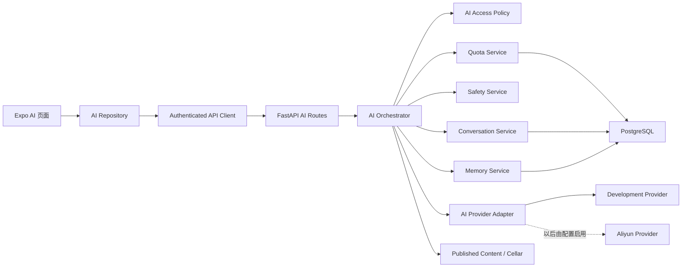
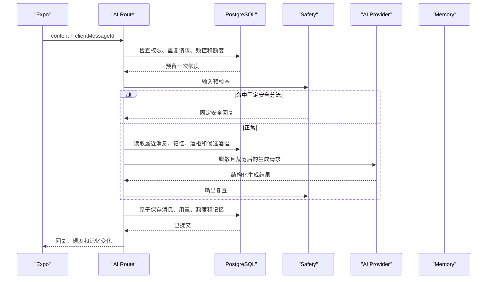
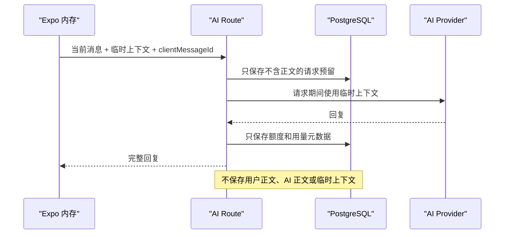

# 杯语 Stage 3 AI 核心能力设计

> 状态：已确认
> 日期：2026-07-29
> 分支：`codex/backend-stage3-ai`
> 前置阶段：Stage 1 账号、资料与私人酒柜；Stage 2 内容平台

## 1. 文档目的

本文件定义杯语 Stage 3 的正式产品和技术设计。该阶段把当前手机端的本地假登录与规则式假回复，升级为由真实账号体系、PostgreSQL 会话数据、每日额度、可控记忆和安全策略共同支撑的 AI 聊天能力。

本阶段默认使用本地 `DevelopmentAiProvider`，不需要云服务器、真实短信或大模型密钥。与此同时，实现可配置的阿里云百炼兼容适配器边界，使后续接入真实模型时不需要改变手机端接口、数据库结构或核心业务流程。

## 2. 目标

Stage 3 完成后，本地环境必须能够演示以下完整流程：

1. 用户使用开发验证码完成真实后端登录。
2. 手机安全保存刷新令牌，并在 App 重启后恢复登录状态。
3. 用户创建普通 AI 会话，连续发送消息并恢复历史。
4. 普通消息、AI 回复、额度和允许的记忆真实写入 PostgreSQL。
5. 用户进入临时聊天并连续对话，退出后聊天正文完全消失。
6. 用户查看、删除、清空或关闭 AI 记忆。
7. 用户删除会话后，消息和仅来源于该会话的记忆永久删除。
8. 第 50 条消息可用，第 51 条消息被准确拒绝。
9. 未成年饮酒、过量饮酒和严重危机内容不会得到饮酒推荐。
10. 后端不可用时，手机保留待发送文字并允许重试，不生成本地假回复。

## 3. 已确认决策

1. 默认使用本地可测试的模拟模型。
2. 预留阿里云百炼兼容适配器，未来只通过配置启用。
3. 第一版使用普通请求/响应，不做流式输出。
4. 后端不可用时不生成假回复。
5. 已经加载到运行内存中的历史可以继续查看。
6. 普通与临时聊天共用每天 50 条免费额度。
7. 额度按北京时间每天 00:00 重置。
8. 临时聊天只在手机运行内存中保留上下文。
9. 临时聊天正文不进入数据库、业务日志或 AsyncStorage。
10. 临时聊天仍记录不含正文的用量、成本和安全分类。
11. 删除普通会话后立即永久删除消息，不设置回收站。
12. 删除会话时，同时删除仅来源于该会话的长期记忆。
13. AI 记忆自动保存，并向用户显示轻提示。
14. 用户可查看、逐条删除、清空或关闭 AI 记忆。
15. 用户关闭记忆后不再读取或新增；现有记忆保留到用户删除。
16. AI 人设是温柔、自然的朋友型调酒师。
17. 默认回复 2 至 5 句，先回应感受，再处理饮品问题。
18. 只有用户明确询问饮品、配方或口味推荐时才返回酒谱。
19. 普通倾诉不强行推荐酒。
20. 命中未成年、过量饮酒或严重危机时不推荐酒。
21. 用户删除的记忆不能从旧聊天中重新生成。
22. Stage 3 包含手机端真实登录桥接，因为受保护的 AI 接口依赖真实令牌。

## 4. 范围

### 4.1 本阶段包含

- 手机端真实短信验证码登录。
- 手机端令牌安全存储、刷新、退出和启动恢复。
- 首次登录本地数据同步与后端启动数据加载。
- 已登录状态下资料、隐私和酒柜的后端同步。
- AI 会话、消息、请求、额度、用量和记忆数据库表。
- 普通会话创建、列表、详情、消息和删除接口。
- 临时聊天接口。
- AI 记忆列表、删除、清空和开关接口。
- 今日额度接口。
- 本地模拟 AI Provider。
- 阿里云百炼兼容 Provider 边界和禁用状态下的实现测试。
- 输入安全检查、输出安全检查和固定安全回复。
- 会话标题生成和酒谱编号校验。
- AI 成本、错误和延迟结构化日志。
- 手机端 AI 页面真实数据接入。
- 手机端 AI 记忆管理页。
- 前端 GitHub Actions 质量门禁。

### 4.2 本阶段不包含

- 真实短信供应商配置。
- 正式云服务器、云数据库和生产域名。
- 实际调用阿里云大模型并产生费用。
- 流式打字效果。
- 语音识别与语音合成。
- Redis、Celery 或其他任务队列。
- 向量数据库、Embedding、RAG 和知识库训练。
- AI 主动向用户发消息。
- 心理诊断、治疗建议或亲密关系模拟。
- 社区、通知和盲盒真实后端。
- 会员支付、额度购买和商业化计费。

## 5. 技术栈

### 5.1 后端

- Python 3.12
- FastAPI
- SQLModel / SQLAlchemy
- PostgreSQL 16
- Alembic
- Pydantic
- HTTPX
- Pytest
- Ruff
- ty

### 5.2 手机端

- Expo 57
- React Native 0.86
- Expo Router
- TypeScript
- Zod
- `expo-secure-store`
- AsyncStorage，仅保存非敏感设备标识和现有本地业务状态
- Jest
- React Native Testing Library

### 5.3 开源参考

实现参考以下项目的边界设计，不整包复制其应用代码：

- [QwenLM/Qwen-Agent](https://github.com/QwenLM/Qwen-Agent)，Apache-2.0：参考 DashScope 与 OpenAI 兼容模型服务的配置方式。
- [guardrails-ai/guardrails](https://github.com/guardrails-ai/guardrails)，Apache-2.0：参考输入、输出校验和结构化结果的职责划分。
- [microsoft/presidio](https://github.com/microsoft/presidio)，MIT：参考可插拔隐私识别器的组织方式。
- [FastAPI Full Stack Template](https://github.com/fastapi/full-stack-fastapi-template)，MIT：沿用前序阶段已经采用的 API、迁移和测试组织方式。

本阶段不增加 Qwen-Agent、Guardrails、Presidio 或 LiteLLM 运行依赖。当前只需要一个开发 Provider 和一个阿里云兼容边界，项目现有的 Pydantic、HTTPX 和模块化接口足以完成需求。任何后续直接复制的第三方代码都必须先核对许可证并更新 `backend/THIRD_PARTY_NOTICES.md`。

## 6. 总体架构



设计原则：

1. 后端是普通会话、额度和记忆的唯一事实来源。
2. 手机端不自行生成 AI 回复。
3. 临时聊天上下文由手机随请求携带，后端只在请求生命周期内使用。
4. Provider 不直接读写数据库，也不决定额度、权限或删除规则。
5. 安全回复可以绕过 Provider，但不能绕过额度、用量记录和响应合同。
6. 外部模型调用不能持有长时间数据库事务。
7. 所有用户资源查询都同时限制 `user_id`，不能只按资源 UUID 查询。

## 7. 模块职责

### 7.1 `auth` 手机端桥接

负责：

- 请求开发短信验证码。
- 使用手机号、验证码和设备信息登录。
- 安全保存刷新令牌。
- 在 App 启动时恢复会话。
- 对同一时刻的多个 `401` 只执行一次令牌刷新。
- 登出时撤销服务器会话并清除本地令牌。

不负责：

- 保存聊天正文。
- 决定 AI 权限。
- 生成 AI 回复。

### 7.2 `ai` 后端模块

负责：

- 普通会话和消息。
- 临时聊天。
- 请求幂等。
- 每日额度和短时间频控。
- 调用安全、记忆、内容与 Provider 接口。
- 统一响应和错误映射。

### 7.3 `ai_safety` 后端模块

负责：

- 输入预检查。
- 输出复查。
- 未成年、过量饮酒和严重危机分流。
- 固定安全回复。
- 禁止高风险场景返回酒谱。

不负责：

- 心理诊断。
- 保存用户消息。
- 修改用户账号状态。

### 7.4 `ai_memory` 后端模块

负责：

- 校验和规范化记忆候选。
- 新增或更新允许的记忆。
- 管理记忆来源。
- 删除、清空和关闭。
- 删除会话后的来源清理。
- 阻止旧聊天重新生成用户主动删除的记忆。

### 7.5 `integrations.ai` Provider 模块

负责：

- 接收已经裁剪和脱敏的生成请求。
- 返回经过 Pydantic 校验的结构化结果。
- 报告 Provider、模型、Token 和延迟。
- 将供应商错误映射为稳定的内部异常。

不负责：

- 用户鉴权。
- 数据库事务。
- 每日额度。
- 会话和记忆删除。

### 7.6 手机端 `AiRepository`

负责：

- 调用 AI 接口。
- 使用 Zod 校验响应。
- 管理普通会话的运行时快照。
- 管理临时聊天的运行时上下文。
- 将稳定错误码转换成页面可使用的状态。

不负责：

- 使用 AsyncStorage 保存聊天正文。
- 在网络失败时生成假回复。

## 8. 手机端真实认证桥接

### 8.1 当前问题

当前 `src/app/login.tsx` 只调用本地 `verifyAge()`，没有请求 `/auth/sms-codes` 或 `/auth/login`。手机端没有保存 access token 或 refresh token，也没有调用 Stage 1 已完成的 `/me/bootstrap` 和 `/me/local-sync`。

AI 接口必须登录，因此 Stage 3 首先补齐这条链路。

### 8.2 令牌存储

- `refreshToken` 使用 `expo-secure-store` 保存。
- `accessToken` 只保存在 React 运行内存。
- 手机端不把任何令牌写入 AsyncStorage、日志或错误提示。
- App 启动时读取 refresh token 并调用 `/auth/refresh`。
- 刷新成功后替换服务端和手机端的 refresh token。
- 刷新失败后清除本地令牌并回到未登录状态。

### 8.3 设备标识

- 生成随机 `installationId`，存入 AsyncStorage。
- 该标识不包含手机号、广告 ID 或硬件序列号。
- 登录时同时提交平台、设备显示名称和 App 版本。
- 同一安装实例重装前保持稳定。

### 8.4 首次登录同步

登录响应 `isNewUser=true` 时：

1. 调用 `/me/local-sync`。
2. 上传本地年龄确认、资料、隐私设置和酒柜配料编号。
3. 调用 `/me/bootstrap` 获取服务器最终状态。
4. 用服务器响应更新手机运行状态和现有本地镜像。

已有用户直接调用 `/me/bootstrap`，不使用本地值覆盖云端值。

### 8.5 已登录数据修改

- 已登录用户修改资料、隐私或酒柜时，先调用对应后端接口。
- 后端成功后，用响应更新手机状态和本地镜像。
- 后端失败时保留编辑输入并提示重试，不伪造保存成功。
- 未登录状态不允许进入 AI 页面。

### 8.6 封禁账号

现有后端认证依赖需要调整为：

- `DELETED` 用户不能通过认证。
- `BANNED` 用户可以恢复登录并读取自己的基础数据。
- AI 模块对 `BANNED` 用户返回 `AI_ACCESS_SUSPENDED`。
- 后续社区模块同样在行为入口单独检查封禁状态。

## 9. 数据库设计

### 9.1 枚举

#### `ai_message_role`

- `USER`
- `ASSISTANT`

#### `ai_chat_mode`

- `NORMAL`
- `TEMPORARY`

#### `ai_request_status`

- `RESERVED`
- `SUCCEEDED`
- `FAILED`
- `EXPIRED`

#### `ai_safety_label`

- `SAFE`
- `ALCOHOL_OVERUSE`
- `MINOR_ALCOHOL`
- `SELF_HARM_CRISIS`
- `PRIVACY_SENSITIVE`
- `OUTPUT_REPLACED`

#### `ai_memory_category`

- `DRINK_PREFERENCE`
- `EMOTIONAL_PREFERENCE`
- `SAFETY_REMINDER`

### 9.2 `ai_conversations`

| 字段 | 类型 | 规则 |
| --- | --- | --- |
| `id` | uuid | 主键 |
| `user_id` | uuid | 外键 `users.id`，级联删除 |
| `title` | varchar(80) | 第一条用户消息生成 |
| `last_message_at` | timestamptz | 列表排序 |
| `created_at` | timestamptz | UTC |
| `updated_at` | timestamptz | UTC |

索引：

- `index(user_id, last_message_at desc, id desc)`。

会话采用硬删除，不增加回收站状态。手机点“新聊天”时只创建本地草稿，首次发送前才调用创建接口。若会话已创建但首条消息最终失败，空会话可以短暂保留以支持重试，但不会出现在列表中。服务在当前用户调用会话列表或创建会话时，顺带删除超过 24 小时且没有有效 `RESERVED` 请求的空会话。

### 9.3 `ai_messages`

| 字段 | 类型 | 规则 |
| --- | --- | --- |
| `id` | uuid | 主键 |
| `conversation_id` | uuid | 外键，删除会话时级联删除 |
| `user_id` | uuid | 外键，用于所有权约束 |
| `role` | enum | `USER` 或 `ASSISTANT` |
| `content` | text | 用户最多 2,000 字；AI 最多 8,000 字 |
| `recipe_ids` | jsonb | 仅 AI 回复使用，默认空数组 |
| `safety_label` | enum | 默认 `SAFE` |
| `created_at` | timestamptz | UTC |

索引：

- `index(conversation_id, created_at, id)`。
- `index(user_id, created_at desc)`。

临时聊天永远不写入该表。

### 9.4 `ai_requests`

该表用于幂等、并发控制和额度预留，不保存聊天正文。

| 字段 | 类型 | 规则 |
| --- | --- | --- |
| `id` | uuid | 主键 |
| `user_id` | uuid | 外键 |
| `conversation_id` | uuid/null | 可空外键；删除会话时 `ON DELETE SET NULL` |
| `client_message_id` | uuid | 手机端生成 |
| `mode` | enum | 普通或临时 |
| `status` | enum | 请求状态 |
| `attempt_count` | int | 默认 1 |
| `quota_date` | date | 北京时间日期 |
| `reservation_expires_at` | timestamptz/null | 预留过期时间 |
| `response_message_id` | uuid/null | 普通聊天成功后指向 AI 消息；删除消息时 `ON DELETE SET NULL` |
| `failure_code` | varchar(80)/null | 不含供应商原始正文 |
| `safety_label` | enum/null | 最终安全分类 |
| `created_at` | timestamptz | UTC |
| `completed_at` | timestamptz/null | UTC |

约束：

- `unique(user_id, client_message_id)`。
- 创建普通请求时，服务层必须提供 `conversation_id`；会话被删除后允许数据库将其置空，以保留不含正文的幂等和用量元数据。
- 临时模式在服务层必须没有 `conversation_id` 和 `response_message_id`，数据库使用 `mode != TEMPORARY OR (conversation_id IS NULL AND response_message_id IS NULL)` 约束。

### 9.5 `ai_daily_quotas`

| 字段 | 类型 | 规则 |
| --- | --- | --- |
| `id` | uuid | 主键 |
| `user_id` | uuid | 外键 |
| `quota_date` | date | 北京时间日期 |
| `free_limit` | int | 默认 50 |
| `used_count` | int | 已完成回复数 |
| `reserved_count` | int | 正在处理数 |
| `created_at` | timestamptz | UTC |
| `updated_at` | timestamptz | UTC |

约束：

- `unique(user_id, quota_date)`。
- `used_count >= 0`。
- `reserved_count >= 0`。
- `used_count + reserved_count <= free_limit`。

### 9.6 `ai_usage_logs`

该表不保存 raw request、raw response 或消息正文。

| 字段 | 类型 | 规则 |
| --- | --- | --- |
| `id` | uuid | 主键 |
| `request_id` | uuid | 外键 `ai_requests.id` |
| `attempt_no` | int | 从 1 开始 |
| `user_id` | uuid | 外键 |
| `conversation_id` | uuid/null | 可空外键；临时聊天为空，删除会话时 `ON DELETE SET NULL` |
| `mode` | enum | 普通或临时 |
| `outcome` | varchar(40) | 成功、安全替换、超时或失败 |
| `provider` | varchar(80) | 供应商 |
| `model` | varchar(120) | 模型名 |
| `prompt_version` | varchar(40) | 人设版本 |
| `input_tokens` | int/null | Provider 返回 |
| `output_tokens` | int/null | Provider 返回 |
| `latency_ms` | int | 非负 |
| `cost_estimate` | numeric(12,6)/null | 估算成本 |
| `safety_label` | enum/null | 最终分类 |
| `created_at` | timestamptz | UTC |

约束：

- `unique(request_id, attempt_no)`。

### 9.7 `ai_memories`

只保存当前有效记忆。用户删除后立即删除摘要正文。

| 字段 | 类型 | 规则 |
| --- | --- | --- |
| `id` | uuid | 主键 |
| `user_id` | uuid | 外键 |
| `category` | enum | 记忆类别 |
| `memory_key` | varchar(80) | 规范化稳定键 |
| `summary` | varchar(240) | 用户可见摘要 |
| `created_at` | timestamptz | UTC |
| `updated_at` | timestamptz | UTC |

约束：

- `unique(user_id, category, memory_key)`。
- 每个用户最多 20 条有效记忆。

### 9.8 `ai_memory_sources`

| 字段 | 类型 | 规则 |
| --- | --- | --- |
| `id` | uuid | 主键 |
| `memory_id` | uuid | 删除记忆时级联删除 |
| `conversation_id` | uuid | 删除会话时级联删除 |
| `source_message_id` | uuid | 删除消息时级联删除 |
| `created_at` | timestamptz | UTC |

约束：

- `unique(memory_id, source_message_id)`。

删除会话后，服务检查受影响记忆：

- 仍有其他来源：保留记忆。
- 已无来源：删除记忆。
- 因删除会话自动删除的记忆不创建 tombstone，用户以后再次明确表达时可以重新记住。

### 9.9 `ai_memory_tombstones`

用户主动删除记忆时创建不可逆标记，不保留原摘要。

| 字段 | 类型 | 规则 |
| --- | --- | --- |
| `id` | uuid | 主键 |
| `user_id` | uuid | 外键 |
| `category` | enum | 原类别 |
| `key_hash` | char(64) | `HMAC-SHA256(memory_key)` |
| `deleted_at` | timestamptz | UTC |

约束：

- `unique(user_id, category, key_hash)`。

HMAC 使用独立配置密钥派生用途标签，不能使用普通未加盐哈希。该表只用于阻止从旧聊天批量恢复；本阶段不会扫描旧消息重建记忆。

## 10. 时间、分页和限制

- 业务时间统一存 UTC。
- 额度日期使用 `ZoneInfo("Asia/Shanghai")` 计算。
- 今日额度响应同时返回下次北京时间 00:00 对应的 UTC 时间。
- 会话列表默认每页 20 条，最大 50 条。
- 消息列表默认每页 50 条，最大 100 条。
- 记忆列表最多返回 20 条，不分页。
- 普通上下文最多最近 20 条消息。
- 临时上下文最多最近 20 条消息，合计最多 12,000 字。
- 超出临时上下文限制时从最早内容开始裁剪。
- 单条用户消息去除首尾空白后长度为 1 至 2,000 字。
- 每个用户每分钟最多接受 10 次 AI 发送请求。
- 同一用户同一时刻只允许一个 `RESERVED` 请求。
- Provider 超时为 20 秒。
- 额度预留有效期为 2 分钟。

## 11. API 合同

所有接口使用 `/api/v1` 前缀、Bearer Token、camelCase JSON 和统一错误信封。

### 11.1 会话列表

`GET /api/v1/ai/conversations?page=1&pageSize=20`

响应：

```json
{
  "items": [
    {
      "id": "4fa9ac8f-0304-4f84-bfbf-c88670c91ce7",
      "title": "今天想喝点清爽的",
      "lastMessageAt": "2026-07-29T08:30:00Z",
      "createdAt": "2026-07-29T08:20:00Z"
    }
  ],
  "pagination": {
    "page": 1,
    "pageSize": 20,
    "totalItems": 1,
    "totalPages": 1
  }
}
```

### 11.2 创建会话

`POST /api/v1/ai/conversations`

请求体为空。响应 `201`：

```json
{
  "id": "4fa9ac8f-0304-4f84-bfbf-c88670c91ce7",
  "title": "新的对话",
  "lastMessageAt": null,
  "createdAt": "2026-07-29T08:20:00Z"
}
```

如果首次消息最终失败且会话仍为空，手机端保留会话 ID 供用户重试，也可以主动删除。列表接口不返回没有消息的会话；服务在列表或创建会话时清理当前用户超过 24 小时且没有有效 `RESERVED` 请求的空会话。

### 11.3 会话详情

`GET /api/v1/ai/conversations/{conversationId}`

只返回当前用户自己的会话元信息。不存在或不属于当前用户统一返回 `AI_CONVERSATION_NOT_FOUND`。

### 11.4 消息列表

`GET /api/v1/ai/conversations/{conversationId}/messages?page=1&pageSize=50`

响应按时间正序：

```json
{
  "items": [
    {
      "id": "b9b5891d-9adb-49ab-b70c-cf8c78492750",
      "role": "USER",
      "content": "今天有点烦，想先聊聊。",
      "recipeIds": [],
      "safetyLabel": "SAFE",
      "createdAt": "2026-07-29T08:21:00Z"
    },
    {
      "id": "4139493e-6e06-49ee-ae7e-b03eb9d851dc",
      "role": "ASSISTANT",
      "content": "听起来今天消耗了你不少力气。先不用急着解决什么，你可以从最让你累的那一小段说起。",
      "recipeIds": [],
      "safetyLabel": "SAFE",
      "createdAt": "2026-07-29T08:21:01Z"
    }
  ],
  "pagination": {
    "page": 1,
    "pageSize": 50,
    "totalItems": 2,
    "totalPages": 1
  }
}
```

### 11.5 发送普通消息

`POST /api/v1/ai/conversations/{conversationId}/messages`

请求：

```json
{
  "content": "我喜欢清爽、低甜的味道。",
  "clientMessageId": "93768922-a6be-4821-9eec-feae85b78f9c"
}
```

响应：

```json
{
  "conversation": {
    "id": "4fa9ac8f-0304-4f84-bfbf-c88670c91ce7",
    "title": "我喜欢清爽低甜",
    "lastMessageAt": "2026-07-29T08:30:01Z",
    "createdAt": "2026-07-29T08:20:00Z"
  },
  "userMessage": {
    "id": "b9b5891d-9adb-49ab-b70c-cf8c78492750",
    "role": "USER",
    "content": "我喜欢清爽、低甜的味道。",
    "recipeIds": [],
    "safetyLabel": "SAFE",
    "createdAt": "2026-07-29T08:30:00Z"
  },
  "assistantMessage": {
    "id": "4139493e-6e06-49ee-ae7e-b03eb9d851dc",
    "role": "ASSISTANT",
    "content": "记下了。以后聊到饮品时，我会优先考虑清爽、低甜的方向。",
    "recipeIds": [],
    "safetyLabel": "SAFE",
    "createdAt": "2026-07-29T08:30:01Z"
  },
  "usage": {
    "limit": 50,
    "used": 1,
    "remaining": 49,
    "resetsAt": "2026-07-29T16:00:00Z"
  },
  "memoryChanges": [
    {
      "id": "b721ce1a-c5bf-4450-90ca-418534c77511",
      "action": "CREATED",
      "category": "DRINK_PREFERENCE",
      "summary": "偏好清爽、低甜的饮品"
    }
  ]
}
```

### 11.6 删除会话

`DELETE /api/v1/ai/conversations/{conversationId}`

成功返回 `204`。操作在同一数据库事务中：

1. 删除消息。
2. 删除记忆来源。
3. 删除已无任何来源的记忆。
4. 删除会话。
5. 保留不含正文的用量记录。

### 11.7 临时聊天

`POST /api/v1/ai/temporary-messages`

请求：

```json
{
  "content": "继续刚才的话题，我更想先被听见。",
  "clientMessageId": "15b961d2-3462-4495-b920-a81d8e418a63",
  "context": [
    {
      "role": "USER",
      "content": "今天不太顺利。"
    },
    {
      "role": "ASSISTANT",
      "content": "我在。你可以慢慢说，不需要先把事情整理好。"
    }
  ]
}
```

响应：

```json
{
  "assistantMessage": {
    "id": "c6d78bb1-f11a-4415-a50b-cf751d73ded3",
    "role": "ASSISTANT",
    "content": "好，那我们先不急着找答案。你想从今天最难受的那个瞬间说起，还是只想让我陪你安静一会儿？",
    "recipeIds": [],
    "safetyLabel": "SAFE",
    "createdAt": "2026-07-29T08:40:00Z"
  },
  "usage": {
    "limit": 50,
    "used": 2,
    "remaining": 48,
    "resetsAt": "2026-07-29T16:00:00Z"
  },
  "memoryChanges": []
}
```

后端处理完成但响应在网络中丢失时，相同 `clientMessageId` 再次发送返回 `TEMPORARY_RESPONSE_NOT_RETAINED`，不重复调用 Provider，也不重复扣额度。

### 11.8 记忆

- `GET /api/v1/ai/memories`
- `DELETE /api/v1/ai/memories/{memoryId}`
- `DELETE /api/v1/ai/memories`
- `PATCH /api/v1/ai/memory-settings`

开关请求：

```json
{
  "enabled": false
}
```

关闭记忆不会删除现有记忆。记忆列表在关闭后仍可查看和删除。

### 11.9 今日额度

`GET /api/v1/ai/usage/today`

```json
{
  "limit": 50,
  "used": 2,
  "remaining": 48,
  "resetsAt": "2026-07-29T16:00:00Z"
}
```

## 12. 普通聊天调用链



Provider 调用发生在短事务之外。额度预留先提交，最终写入使用新的短事务完成。

## 13. 临时聊天调用链



临时聊天不读取或写入长期记忆。它可以读取已发布酒谱和当前用户酒柜，但不读取普通会话历史。

## 14. 额度、并发和幂等

### 14.1 北京时间日期

服务使用 `ZoneInfo("Asia/Shanghai")` 从当前 UTC 时间计算 `quota_date`。测试通过注入时钟覆盖北京时间 23:59、00:00 和夏令时无关边界。

### 14.2 预留

一次请求开始时：

1. 清理该用户超过 2 分钟的 `RESERVED` 请求。
2. 在事务中锁定或创建今日 `ai_daily_quotas`。
3. 检查是否存在另一个有效的 `RESERVED` 请求。
4. 检查 `used_count + reserved_count < free_limit`。
5. 创建或更新 `ai_requests` 为 `RESERVED`。
6. `reserved_count += 1` 并提交。

### 14.3 成功

普通聊天成功时，在一个事务中：

- 保存用户消息和 AI 消息。
- 更新会话标题与时间。
- 写入记忆变化。
- `reserved_count -= 1`。
- `used_count += 1`。
- 请求变为 `SUCCEEDED`。
- 写入 usage log。

临时聊天成功时不保存消息和记忆，其余额度与 usage log 行为相同。

### 14.4 失败

超时、Provider 错误或内部错误时：

- `reserved_count -= 1`。
- 请求变为 `FAILED`。
- 写入不含正文的失败 usage log。
- 不增加 `used_count`。
- 手机端可使用相同 `clientMessageId` 重试。

安全固定回复属于成功回复，占用一次额度。

### 14.5 重复请求

- 普通请求已经成功：返回已保存的原回复。
- 普通请求正在处理：返回 `AI_REQUEST_IN_PROGRESS`。
- 普通请求之前失败：增加 `attempt_count` 后允许重试。
- 临时请求已经成功：返回 `TEMPORARY_RESPONSE_NOT_RETAINED`。
- 临时请求正在处理：返回 `AI_REQUEST_IN_PROGRESS`。
- 临时请求之前失败：允许使用相同 ID 重试。

## 15. Provider 设计

### 15.1 接口

```python
class AiProvider(Protocol):
    def generate(self, request: AiGenerationRequest) -> AiGenerationResult:
        ...
```

`AiGenerationRequest` 包含：

- `system_prompt`
- `messages`
- `memories`
- `cellar_ingredient_ids`
- `candidate_recipes`
- `max_output_chars`

`AiGenerationResult` 包含：

- `reply_text`
- `recipe_ids`
- `memory_candidates`
- `provider`
- `model`
- `input_tokens`
- `output_tokens`
- `cost_estimate`

### 15.2 Development Provider

开发 Provider 必须：

- 结果可预测，测试不依赖随机数。
- 根据用户语句先生成情绪回应。
- 只有明确饮品意图时才使用候选酒谱。
- 返回符合 Pydantic 模型的记忆候选。
- 支持在测试中模拟超时、错误和不安全输出。
- 不访问网络。

它不是手机端假数据。所有回复仍经过真实登录、额度、安全、持久化和记忆流程。

### 15.3 Aliyun Provider

阿里云适配器使用项目现有 HTTPX 调用 OpenAI 兼容 Chat Completions 接口：

- API Key 只从环境变量读取。
- 使用明确的 base URL allowlist 和 HTTPS。
- 设置 20 秒总超时。
- 不在应用日志记录请求头或正文。
- 使用 Pydantic 校验结构化 JSON。
- 未知字段忽略，缺少必要字段视为 Provider 错误。
- 供应商返回的 recipe ID 必须再次对照已发布酒谱。

默认配置为 `development`。非开发环境禁止启用 Development Provider；选择 `aliyun` 时必须同时提供 API Key、HTTPS base URL 和模型名。

## 16. 人设与上下文

### 16.1 人设

固定系统人设使用版本化常量，例如 `beiyu-bartender-v1`：

- 温柔、自然、克制。
- 更像会调酒的朋友，不像客服或医生。
- 默认 2 至 5 句。
- 先回应情绪，再回应问题。
- 不使用强行积极、说教或模板化长清单。
- 不暗示自己是真人。
- 不鼓励用户依赖 AI 替代现实关系。
- 不把酒精描述成解决痛苦的方法。

### 16.2 上下文

普通聊天上下文按以下顺序构造：

1. 固定系统人设和安全边界。
2. 当前用户最多 20 条有效记忆。
3. 当前会话最近 20 条消息。
4. 当前用户酒柜配料编号。
5. 服务端筛选出的少量已发布候选酒谱。
6. 当前用户消息。

不加入：

- 手机号。
- 设备信息。
- 其他用户内容。
- 身份证、真实姓名或住址。
- 管理员备注。
- 已删除记忆。
- 整个历史会话全集。

### 16.3 会话标题

第一条用户消息成功后由后端规则生成标题：

- 去除换行和多余空白。
- 最多 30 个中文字符或 60 个 ASCII 字符。
- 空内容不创建会话。
- 不额外调用模型生成标题。

## 17. 安全设计

### 17.1 输入预检查

输入分类由可测试的规则引擎完成：

- 年龄状态与未成年饮酒表达。
- 明确的继续大量饮酒、醉酒后继续推荐等表达。
- 明确的自伤或严重危机表达。
- 证件号、银行卡、详细住址等不应写入记忆的隐私模式。

规则命中只决定安全路径，不在业务日志记录原句。

### 17.2 固定安全路径

#### 过量饮酒

- 温和建议停止继续饮酒。
- 建议补水、休息并联系身边可信任的人。
- 不返回酒谱。

#### 未成年饮酒

- 不提供酒精饮品建议。
- 可以提供无酒精饮品方向。
- 不返回含酒精酒谱。

#### 严重危机

- 使用后端固定且经过测试的温暖回应。
- 鼓励联系现实中可信任的人和当地紧急服务。
- 不进行诊断。
- 不返回酒谱。
- 不把危机具体内容写入长期记忆。

### 17.3 输出复查

Provider 输出必须通过：

- 最大长度。
- 空回复检查。
- 酒谱 ID allowlist。
- 高风险场景禁酒检查。
- 禁止声称心理诊断。
- 禁止鼓励继续大量饮酒。
- 禁止暴露系统提示词或内部字段。

不安全输出被替换为固定安全回复，标记 `OUTPUT_REPLACED`。

### 17.4 上线边界

本地规则引擎足以完成确定性开发和验收，但不宣称能识别所有现实风险。正式启用真实模型前，必须再完成供应商内容安全能力评估、中文安全测试集扩充和隐私政策更新。

## 18. 记忆设计

### 18.1 允许的记忆

#### 饮品偏好

- 偏甜、低甜、清爽、浓郁等稳定口味。
- 喜欢或避免的配料。
- 偏好无酒精或低酒精方向。

#### 情绪偏好

- 希望先被倾听。
- 喜欢简短回应。
- 希望得到温柔鼓励。

#### 安全提醒

- 避免酒精。
- 避免某种配料。

安全提醒只保存必要结论，不保存疾病名称、用药原因或诊断信息。

### 18.2 禁止的记忆

- 当天发生的具体事件。
- 具体人物和关系冲突。
- 工作单位、学校班级和详细行程。
- 住址、证件、银行卡和验证码。
- 医疗诊断和详细病史。
- 自伤或危机原句。
- AI 自己推断而用户没有明确表达的偏好。

### 18.3 结构化候选

```text
category
memoryKey
summary
confidence
sensitive
```

只有满足以下条件才写入：

- 普通聊天。
- 用户开启记忆。
- 来自用户本轮明确表达。
- 类别在 allowlist。
- `sensitive=false`。
- 通过摘要长度与字符校验。
- 未命中主动删除 tombstone。

### 18.4 更新和上限

- 同一 `user_id + category + memory_key` 更新原记录。
- 只有摘要真正变化时返回 `UPDATED` 提示。
- 达到 20 条后不自动删除旧记忆。
- 新候选超过上限时跳过，并在内部记录非敏感原因。

### 18.5 删除

用户主动删除：

1. 计算 `HMAC-SHA256(memory_key)`。
2. 创建 tombstone。
3. 删除来源。
4. 删除记忆摘要。

清空记忆对每条当前记忆执行相同流程。

删除会话：

1. 删除该会话的来源。
2. 删除没有其他来源的记忆。
3. 不创建 tombstone。

## 19. 手机端状态与交互

### 19.1 Provider 层级

```text
ContentProvider
  -> AuthProvider
    -> MixologyProvider
      -> AiProvider
        -> App UI
```

`AuthProvider` 负责令牌和 bootstrap。`AiProvider` 只负责 AI 运行状态，避免继续扩大已经较大的 `MixologyProvider`。

### 19.2 AI 页面状态

页面显式表示：

- `idle`
- `loadingHistory`
- `loadingConversation`
- `sending`
- `retryableError`
- `quotaExhausted`
- `temporary`

一次发送期间禁用再次发送。用户原输入在请求失败后保留，并显示重试操作。

### 19.3 历史抽屉

真实会话按北京时间分组：

- 今天
- 昨天
- 过去 7 天
- 更早

删除入口使用明确菜单和二次确认。抽屉搜索不在本阶段实现。

### 19.4 新会话

- 点“新聊天”只重置本地页面。
- 首次发送时创建会话并立即发送消息。
- 创建成功但消息失败时保留会话 ID供重试。
- 服务端列表不展示空会话。
- 服务端在列表或创建会话时清理超过 24 小时且没有有效请求预留的空会话。

### 19.5 临时聊天

- 点临时聊天图标进入临时模式。
- 普通历史不会作为上下文。
- 当前临时消息只存在 React state。
- 选择普通历史、新建普通聊天、退出 AI 页面、退出登录或 App 重启时清空。
- 临时消息不写入 AsyncStorage。

### 19.6 额度

- 正常情况下不持续强调额度。
- 剩余 10 条及以下时在输入区附近显示。
- 剩余 0 条时禁用发送并显示北京时间次日重置。

### 19.7 记忆提示

新增或更新记忆后显示短提示，例如：

```text
已记住：偏好清爽、低甜的饮品
```

提示可进入 AI 记忆管理页。页面支持开关、逐条删除和清空全部。

### 19.8 初始 prompt

首页或其他页面传入 `prompt` 时：

- 等待认证和 AI 状态就绪。
- 只消费一次参数。
- 使用一个稳定的 `clientMessageId`。
- 成功或明确失败前不重复发送。
- 临时模式下不自动消费普通推荐 prompt。

### 19.9 酒谱卡片

- 后端只返回已发布酒谱 ID。
- 手机端从当前 ContentProvider 快照解析酒谱。
- 找不到的 ID 静默忽略，不导致整条消息失败。
- 用户明确请求饮品时才显示“生成配方”或酒谱卡片。

## 20. 错误合同

| HTTP | 错误码 | 手机端行为 |
| --- | --- | --- |
| 401 | `AUTHENTICATION_REQUIRED` | 尝试刷新一次 |
| 401 | `INVALID_ACCESS_TOKEN` | 刷新失败后回登录 |
| 403 | `AGE_CONFIRMATION_REQUIRED` | 引导完成年龄确认 |
| 403 | `AI_ACCESS_SUSPENDED` | 显示账号暂不可使用 AI |
| 403 | `AI_FEATURE_DISABLED` | 显示功能暂未开放 |
| 404 | `AI_CONVERSATION_NOT_FOUND` | 返回新聊天 |
| 409 | `AI_REQUEST_IN_PROGRESS` | 保持等待或稍后重试 |
| 409 | `TEMPORARY_RESPONSE_NOT_RETAINED` | 说明临时回复无法恢复 |
| 429 | `AI_RATE_LIMITED` | 显示短时间后重试 |
| 429 | `AI_DAILY_QUOTA_EXHAUSTED` | 显示重置时间 |
| 422 | `VALIDATION_ERROR` | 保留输入并提示长度或格式 |
| 503 | `AI_PROVIDER_UNAVAILABLE` | 保留输入并显示重试 |
| 504 | `AI_PROVIDER_TIMEOUT` | 保留输入并显示重试 |

所有错误继续使用：

```json
{
  "error": {
    "code": "AI_PROVIDER_TIMEOUT",
    "message": "回复暂时没有生成，请稍后重试",
    "details": {}
  }
}
```

错误响应不包含供应商原始错误、堆栈、prompt、消息正文或密钥。

## 21. 配置

新增环境变量：

```text
BEIYU_AI_ENABLED=true
BEIYU_AI_PROVIDER=development
BEIYU_AI_MODEL=beiyu-development-v1
BEIYU_AI_DAILY_LIMIT=50
BEIYU_AI_REQUESTS_PER_MINUTE=10
BEIYU_AI_TIMEOUT_SECONDS=20
BEIYU_AI_RESERVATION_SECONDS=120
BEIYU_AI_CONTEXT_MESSAGES=20
BEIYU_AI_MEMORY_LIMIT=20
BEIYU_AI_BASE_URL=
BEIYU_AI_API_KEY=
BEIYU_AI_MEMORY_HMAC_KEY=
```

规则：

- `development` Provider 只能用于 `dev`。
- `staging` 和 `prod` 必须使用非开发 Provider。
- `aliyun` 必须配置 HTTPS base URL、API Key 和非空模型名。
- 非开发环境的 memory HMAC key 至少 32 字节且不能等于普通示例值。
- SecretStr 配置不得出现在日志和 OpenAPI。

## 22. 隐私与安全

- AI 接口全部要求 Bearer Token。
- 所有查询同时校验资源所属用户。
- 手机端 refresh token 只进入 SecureStore。
- 手机端不持久化普通或临时聊天正文。
- 后端不记录原始模型请求和原始模型响应。
- 临时聊天正文不写入数据库。
- 使用固定路径模板记录请求日志，不记录 URL 中的用户输入。
- Provider 请求只包含本轮需要的最小上下文。
- 删除会话使用数据库事务。
- 删除记忆正文后只保留不可逆 HMAC 标记。
- 配置和测试中不提交真实手机号、模型密钥或云数据库密钥。
- 正式模型上线前更新隐私说明，明确第三方模型供应商的数据处理边界。

## 23. 可观测性

结构化日志和用量表允许观察：

- Provider 与模型。
- 普通或临时模式。
- 成功、安全替换、超时和失败。
- 输入/输出 Token。
- 估算成本。
- 总延迟。
- 安全分类。
- 请求编号。
- prompt 版本。

不得记录：

- 用户或 AI 正文。
- 临时上下文。
- 记忆摘要。
- 手机号。
- access token、refresh token 或 API Key。
- 完整用户 UUID；需要关联时使用请求编号和数据库内受限查询。

上线指标预留：

- AI 请求成功率。
- Provider 超时率。
- P50、P95 延迟。
- 每日调用数和 Token。
- 每日估算成本。
- 安全替换数量。
- 额度耗尽用户数。

本阶段使用现有结构化日志和数据库查询完成本地验收，不引入 Prometheus 或第三方监控服务。

## 24. 测试策略

### 24.1 后端模型与迁移

- 所有新表、枚举、索引和约束存在。
- 外键删除行为符合设计。
- 迁移可从 Stage 2 head 升级。
- downgrade 后不残留 Stage 3 枚举。

### 24.2 鉴权

- 开发验证码真实登录。
- refresh token 安全轮换。
- `DELETED` 用户不能认证。
- `BANNED` 用户可读取自己的基础数据但不能使用 AI。
- 年龄未确认不能使用 AI。
- AI feature flag 关闭时不能发送。

### 24.3 会话

- 创建、列表、详情和消息分页。
- 会话和消息严格用户隔离。
- 列表不返回空会话。
- 超过 24 小时且没有有效请求预留的空会话会被顺带清理。
- 删除会话永久删除消息。
- 删除会话清理仅有该来源的记忆。
- 有其他来源的记忆继续保留。
- 删除会话后 `ai_requests` 和 `ai_usage_logs` 保留，关联会话与消息字段被置空。

### 24.4 临时聊天

- 可以使用请求内上下文连续聊天。
- 不创建 `ai_messages`。
- 不创建 `ai_memories` 或 `ai_memory_sources`。
- 不在 usage log 保存正文。
- 仍增加成功额度。
- 成功响应丢失后相同 ID 不重复调用或扣费。

### 24.5 额度与幂等

- 北京时间 23:59 和 00:00 边界。
- 第 50 条成功，第 51 条拒绝。
- Provider 失败和超时释放预留。
- 过期预留自动回收。
- 并发请求只能有一个进入 Provider。
- 普通成功请求重试返回原回复。
- 失败请求使用相同 ID可以重试。

### 24.6 安全

- 普通情绪聊天不推荐酒。
- 明确饮品请求可以返回酒谱。
- 过量饮酒不返回酒谱。
- 未成年饮酒不返回含酒精酒谱。
- 严重危机使用固定安全回复。
- Provider 返回不安全文本时被替换。
- 未发布或不存在的酒谱 ID 被移除。
- 敏感隐私不写入记忆。

### 24.7 记忆

- 明确稳定偏好创建记忆。
- 同一 key 更新而不重复。
- 临时聊天不产生记忆。
- 关闭后不读取或新增。
- 主动删除后摘要不存在且 tombstone 存在。
- 旧聊天不会重建 tombstone 记忆。
- 清空全部记忆。
- 20 条上限。

### 24.8 Provider

- Development Provider 输出稳定。
- 正常、饮品和情绪测试样例。
- Aliyun 请求地址、请求头和结构正确。
- HTTPX 超时、非 2xx、无效 JSON 和无效结构映射成稳定错误。
- 测试使用 MockTransport，不访问真实网络。
- 日志不包含 API Key 或消息正文。

### 24.9 手机端认证

- refresh token 只写 SecureStore。
- access token 不写 AsyncStorage。
- 启动恢复和刷新失败退出。
- 多请求 `401` 只触发一次刷新。
- 首次登录执行 local sync 后 bootstrap。
- 已有用户不使用本地数据覆盖云端。
- 退出登录清除 AI 临时状态。

### 24.10 手机端 AI

- 真实会话列表和分组。
- 新会话首次发送才持久化。
- 发送中禁用重复发送。
- 失败保留输入并可重试。
- prompt 参数只发送一次。
- 临时聊天切换或卸载后清空。
- 不调用旧 `createMockAiReply`。
- 额度低和耗尽状态。
- 记忆提示与管理。
- 删除会话确认。
- 异步测试无卸载后更新警告。

## 25. CI

### 25.1 后端

继续运行：

- `uv sync --frozen`
- Alembic upgrade
- Ruff
- ty
- PostgreSQL Pytest
- migration upgrade/downgrade
- Docker build smoke

### 25.2 前端

新增独立 GitHub Actions job：

- `npm ci`
- `npm run lint`
- `npm run typecheck`
- `npm test -- --runInBand`

前端 job 不需要真实 API、短信或模型密钥。

## 26. 实施拆分

### Stage 3A：真实认证桥接

- Auth API client。
- SecureStore。
- 登录、刷新、登出和启动恢复。
- local sync 与 bootstrap。
- 已登录资料、隐私和酒柜同步。
- 认证测试。

### Stage 3B：AI 后端

- 数据库迁移。
- 权限、额度、幂等和频控。
- 会话和临时聊天。
- Provider。
- 安全和记忆。
- OpenAPI、日志和后端测试。

### Stage 3C：AI 手机端

- AiRepository 与 Zod 合同。
- AiProvider 状态层。
- 真实历史、发送、删除和重试。
- 临时聊天。
- 额度展示。
- 记忆管理。
- 前端 CI。

每一小段都必须保持应用可启动、测试可运行，并形成独立提交。

## 27. 本地验收

1. 启动 Docker PostgreSQL 和 API。
2. 执行 Alembic migration。
3. 使用开发短信 Provider 请求验证码。
4. 使用开发六位验证码登录。
5. 完成年龄确认与首次同步。
6. 进入 AI 页面并发送普通情绪聊天。
7. 确认回复不强行推荐酒。
8. 明确请求清爽低甜饮品并看到有效酒谱卡片。
9. 重启 App 并恢复普通历史。
10. 查看新生成记忆。
11. 删除一条记忆并确认旧聊天不会恢复它。
12. 创建临时聊天并连续发送两轮。
13. 退出 AI 页面后重新进入，确认临时聊天消失。
14. 查询数据库，确认临时正文不存在。
15. 将额度设置到 49，验证第 50 条成功、第 51 条拒绝。
16. 模拟 Provider 超时，确认输入保留且额度不增加。
17. 输入过量饮酒、未成年饮酒和严重危机测试语句，确认不返回酒谱。
18. 删除普通会话，确认消息和仅来源于该会话的记忆消失。
19. 运行前端完整检查。
20. 运行后端完整检查、迁移测试和 Docker smoke。
21. 启动 Expo 并生成 iOS bundle。
22. 推送 GitHub 并等待前后端 CI 全部通过。

## 28. 验收标准

1. 手机端使用真实后端登录，不再依赖本地假登录进入 AI。
2. 令牌存储和刷新符合设计。
3. 普通会话在 PostgreSQL 中真实保存并严格隔离用户。
4. 临时聊天正文不出现在数据库、AsyncStorage 或日志中。
5. 每日额度按北京时间准确执行。
6. 重复发送和网络重试不会重复扣额度。
7. Development Provider 可以完成稳定的本地演示。
8. 阿里云 Provider 可以通过配置启用，默认不访问网络。
9. 安全分类能够阻止高风险饮酒推荐。
10. AI 只保存允许且用户可见的轻量记忆。
11. 用户可以永久删除会话和记忆。
12. 后端不可用时手机不生成假回复。
13. OpenAPI 与 Zod 合同一致。
14. 前端和后端 lint、类型检查、测试和迁移全部通过。
15. Docker、Expo bundle 和 GitHub Actions 全部通过。

## 29. 设计自检结论

- 所有产品选择均来自本轮用户确认。
- Stage 3A、3B、3C 具有明确依赖顺序，不需要拆成独立产品项目。
- 临时聊天、普通聊天、额度和删除语义没有冲突。
- 本阶段不依赖尚未购买的服务器、数据库、短信或模型服务。
- 真实模型启用条件明确，不会在开发环境外误用 Development Provider。
- 没有实现阻断项，所有本阶段行为均有明确规则。
